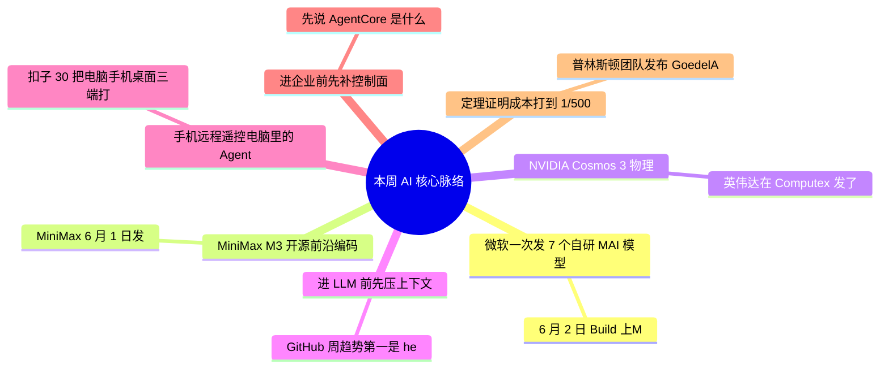

> **导语**：AI周报，一周AI脉络。这期二十七条，不按流水账，先看四条主线。

---

## 🗺️ 本周主线脉络

---

## 🌟 核心深度剖析（7 大重磅事件）

### 01. [微软一次发 7 个自研 MAI 模型](https://microsoft.ai/news/building-a-hillclimbing-machine-launching-seven-new-mai-models/)
- **发布主体**：微软 Build · 06/02
- **核心事实**：6 月 2 日 Build 上，Microsoft 一口气发了七个自研 MAI 模型，主角是它第一个推理模型 MAI-Thinking-1，微软说能力对标 Claude。
- **行业影响**：旁边还有 MAI-Image-2.5、MAI-Voice-2、转写和代码模型。重点不是多几个名字，而是微软在明确减少对 OpenAI 的依赖、自己走全栈。
- **实操与避坑建议**：微软这步是给 Azure 客户递刀子——你既然在它云上，迟早会被推这套自家模型。与其到时候被动接，不如现在就拉进评测知道底牌；但 private preview 阶段别迁任何生产流量。

---

### 02. [MiniMax M3 开源前沿编码](https://www.minimax.io/blog/minimax-m3)
- **发布主体**：MiniMax · 06/01
- **核心事实**：MiniMax 6 月 1 日发布并开源 M3：主打前沿编码加百万 token 上下文，官方榜单声称超过 GPT-5.5，API 标价每百万 token 输入 0.3、输出 1.2 美元。
- **行业影响**：但头几天的社区实测口碑明显分化：有用户报指令跟随不稳、agent 任务实际 token 消耗大，同样的工作负载账单反而高出数倍；相对上一代 M2.7，价格也涨了不少。
- **实操与避坑建议**：别被『开源登顶加白菜价』上头——纸面单价低不等于真实账单低，agent 任务费的是重试和长上下文。真想用，拿自己的任务跑一周账单再下结论；只是围观，等两周社区复现也不迟。

---

### 03. [NVIDIA Cosmos 3 物理 AI 世界基座](https://nvidianews.nvidia.com/news/nvidia-launches-cosmos-3-the-open-frontier-foundation-model-for-physical-ai)
- **发布主体**：NVIDIA · Computex
- **核心事实**：英伟达在 Computex 发了 Cosmos 3，一个面向物理 AI 的开放世界基座模型。
- **行业影响**：它不是给聊天的，是给机器人、自动驾驶、具身智能当『世界先验』的。
- **实操与避坑建议**：做机器人和仿真的重点看；纯应用层的先放进雷达，知道物理 AI 这条线在加速就行。

---

### 04. [headroom：进 LLM 前先压上下文](https://github.com/chopratejas/headroom)
- **发布主体**：GitHub 周趋势 #1
- **核心事实**：GitHub 周趋势第一是 headroom：把工具输出、日志、文件和 RAG 片段在进 LLM 之前先压缩，声称省 60-95% token、答案不变。
- **行业影响**：很现实——很多 agent 的钱不是花在推理，是花在反复把冗长日志喂给模型。提供 library / proxy / MCP server 三种用法。
- **实操与避坑建议**：适合先拿它压 CI 日志、网页抽取这类噪声高、可回源的材料；法律财务医学这种不能丢措辞的，别拿压缩结果当唯一事实源。

---

### 05. [字节扣子 3.0：手机远程遥控电脑里的 Agent](#)
- **发布主体**：字节 · 扣子 3.0
- **核心事实**：扣子 3.0 把电脑、手机、桌面三端打通，能用手机远程遥控你电脑里的 agent 干活。
- **行业影响**：这是国产 agent 产品形态上比较激进的一步。
- **实操与避坑建议**：别看演示，看三件真东西：权限边界清不清楚、出错能不能接管、跨端状态稳不稳。

---

### 06. [AWS AgentCore：进企业前先补控制面](https://aws.amazon.com/blogs/machine-learning/agentops-operationalize-agentic-ai-at-scale-with-amazon-bedrock-agentcore/)
- **发布主体**：AWS AgentCore
- **核心事实**：先说 AgentCore 是什么：AWS 放在 Bedrock 下面的 agent 托管平台，给企业 agent 提供运行时，加上身份、预算、工具权限这一整层控制面。这周 AWS 连发几篇博客把它的运维方法论讲透了。
- **行业影响**：它把话说得很直白：agent 不是写死的流程，会做不可预测的决策、成本会失控、失败难调，所以 MCP 网关的访问控制、OAuth 身份、密钥管理、预算和人工接管，一样都不能少。
- **实操与避坑建议**：这张清单值得直接抄走——哪怕你根本不用 AWS：trace、预算、身份、工具权限、人工接管，五样缺任何一样，agent 就别放进核心系统。

---

### 07. [普林斯顿 Goedel-Architect：定理证明成本打到 1/500](https://m.36kr.com/p/3841174468151553)
- **发布主体**：arXiv · Princeton
- **核心事实**：普林斯顿团队发布 Goedel-Architect：一个自动写数学证明的智能体框架——先把定理拆成证明蓝图，再逐步生成、用 Lean 4 逐行校验，错了自动修。
- **行业影响**：战绩是用 294 美元跑完了过去要花 17 万美元的证明任务，多项纪录刷新。注意底座只是已发布一阵的 DeepSeek-V4-Flash——新东西是这套流程设计，不是模型。
- **实操与避坑建议**：它的启发根本不在数学：很多『贵』是流程没设计好。蓝图、校验、自动修这三板斧，搬到代码生成和合规审查，一样可能省下两个数量级。

---

## ⚡ 全景快讯扫读

### 📌 新闻 · 其余

- **[Qwen3.7-Plus](https://qwen.ai/blog?id=qwen3.7-plus)**：阿里新发的多模态 agent 模型：把看屏幕、点界面、写代码放进同一个循环，能自主跑完任务 *(The Decoder)*
- **[Gemma 4 12B](https://blog.google/innovation-and-ai/technology/developers-tools/gemma-4/)**：谷歌开源的 12B 多模态模型，文字图像音频一起处理，Apache 2.0，笔记本就能本地跑 *(Google)*
- **[GPT-Rosalind](https://openai.com/research/gpt-rosalind)**：OpenAI 面向生命科学的专用模型：蛋白、基因组、药物化学推理——科研版 GPT *(OpenAI)*
- **[AWS Bedrock](https://openai.com/index/openai-frontier-models-and-codex-are-now-available-on-aws)**：OpenAI 前沿模型和 Codex 正式上架亚马逊云，企业在自家云环境里就能直接采购 *(OpenAI/AWS)*
- **[Dreaming](https://openai.com/index/chatgpt-memory-dreaming)**：ChatGPT 新记忆系统：像睡眠巩固记忆一样整理你的对话史，个性化更准、上下文更新鲜 *(OpenAI)*
- **[GitHub Copilot](https://github.blog/changelog/2026-06-05-gpt-5-2-and-gpt-5-2-codex-deprecated)**：模型池换代，加云端 agent 任务接口和百万 token 上下文——从补全工具变成 agent 平台 *(GitHub)*

### 📌 开源 · 其余

- **[安全 harness](https://www.anthropic.com/news)**：Anthropic 开源的安全框架：能自动发现代码漏洞并打补丁——安全工作开始 agent 化 *(Anthropic)*
- **[VoxCPM2](https://github.com/OpenBMB/VoxCPM)**：OpenBMB 开源的免 tokenizer 语音合成：多语言、可克隆音色，本周冲上趋势榜 *(GitHub)*
- **[supermemory](https://github.com/supermemoryai/supermemory)**：开源记忆引擎：给 AI 应用加一层快速、可扩展的长期记忆 API，一周近三千星 *(GitHub)*

### 📌 产品 · 其余

- **[Dreambeans](https://labs.google/dreambeans)**：谷歌 Labs 实验应用：读你的邮件日历相册，把生活编成每日插画故事——个人数据入口实验 *(Google)*
- **[得物 AI Harness](https://www.infoq.cn/article/dewu-ai-harness)**：得物推荐系统的工程实践：从放任 AI 乱写代码到按目标生产——难得的中文一手经验 *(InfoQ)*
- **[Grok Imagine 1.5](https://x.ai/news/grok-imagine-1-5)**：xAI 图生视频模型：720p、带原生音效和对口型，本周登顶视频竞技场 *(xAI)*

### 📌 工程 · 其余

- **[OpenAI CFO](https://www.infoq.cn/article/openai-cfo-strategy)**：首次详谈商业版图：B 端 C 端收入五五开、不抢 IPO 排位，今年还要拿出 AI 硬件 *(InfoQ)*
- **[2-bit KV Cache](https://www.qbitai.com/2026/06/together-kv.html)**：Together AI 把推理缓存压到 2 比特并上了生产——长上下文的显存账单直接砍半再砍半 *(量子位)*

### 📌 论文 · 其余

- **[DragOn](https://arxiv.org/abs/2606.06322)**：GUI agent 评测新基准：点按钮之外补上拖拽、选区、缩放——28.6 万截图、350 万任务 *(arXiv)*
- **[Agent Memory](https://arxiv.org/abs/2606.06448)**：第一篇从系统视角刻画 agent 记忆的论文：把存储、检索、更新的成本逐项拆开算账 *(arXiv)*
- **[ToolChoiceConfusion](https://arxiv.org/abs/2606.06448)**：工具给多了反而出错：只暴露当前步骤的最小工具集，调用更稳、token 更省 *(arXiv)*

### 📌 行业与人事 · 高门槛

- **[Anthropic S-1](https://www.anthropic.com/news/confidential-draft-s1-sec)**：机密递交招股书、正式启动 IPO 流程——大模型第一股的竞速开始了 *(Anthropic)*
- **[350 亿美元](https://www.bloomberg.com/news/articles/2026-06-05/apollo-wraps-up-35-billion-debt-to-buy-ai-chips-for-anthropic)**：Apollo 牵头融资为 Anthropic 采购算力芯片——资本开始给 AI 算力单独开账本 *(Bloomberg)*
- **[Muse Spark](https://www.reuters.com/technology/meta-repeatedly-pushes-back-new-ai-model-release-developers-wsj-says-2026-06-04/)**：Meta 新模型 API 再度推迟、至今没有时间表——头部阵营里掉队的信号 *(Reuters)*

---

## 🎯 下周继续盯什么
