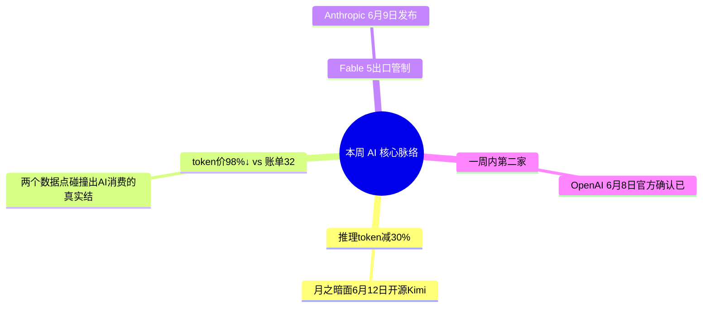

> **导语**：AI周报，一周AI脉络。这期三十三条，不按流水账，先看四条主线。

---

## 🗺️ 本周主线脉络

---

## 🌟 核心深度剖析（4 大重磅事件）

### 01. [Kimi K2.7-Code：推理token减30%](https://www.kimi.com/blog/kimi-k2-7-code)
- **发布主体**：Moonshot AI · 06/12
- **核心事实**：月之暗面6月12日开源Kimi K2.7-Code——1万亿参数MoE编码模型，官方口径推理token减30%、Kimi Code Bench分数涨21.8%，Cloudflare Workers AI同日上线。这是K2系列第五个大版本，一年内从K2迭代到K2点7。
- **行业影响**：编码效率曲线还在掉：开源旗舰用更少的思考步数达到同等质量。VentureBeat采访从业者反馈benchmark数字对不上真实任务，但推理token减少这件事在实际使用中确实感知明显。
- **实操与避坑建议**：长程编码任务值得试K2.7-Code的token效率；但别只看榜单，按真实代码库测推理成本和可用性——benchmark和生产是两回事。

---

### 02. [AI账单经济学：token价98%↓ vs 账单320%↑](https://ramp.com/blog/ai-spend-report-2026)
- **发布主体**：Ramp / Stanford AI Index · 本周
- **核心事实**：两个数据点碰撞出AI消费的真实结构：token价格两年跌98%（OpenAI API从$0.12跌到$0.003每百万token），但Ramp统计企业AI账单同期涨320%。Stanford AI Index报告补充细节——AI应用前1%用户人均月消费$7500，是中位数的650倍；Ramp客户AI支出已达$44B年化规模。
- **行业影响**：价格战没压住总支出，反而释放了需求——用量涨幅远超降价幅度。Linux Foundation本周发布Tokenomicon报告，试图给token经济学建标准框架，背后是这条曲线已经影响整个行业的成本结构。
- **实操与避坑建议**：成本优化的重点不是换便宜模型，是控用量——按真实业务价值设token预算，监控前1%用户，别让长尾prompt把账单拉成指数分布。

---

### 03. [围栏风暴：Fable 5出口管制](https://www.anthropic.com/news/fable-mythos-access)
- **发布主体**：Anthropic / WSJ · 06/12
- **核心事实**：Anthropic 6月9日发布Claude Fable 5——第一个公开的Mythos级模型，定价翻倍、流量保留30天做安全监控。发布三天内连出三件事：用户抗议护栏过严（WSJ报道）；微软以数据保留政策为由内部禁用；6月12日美国政府发出出口管制指令——暂停所有外国用户访问Fable 5和Mythos 5。
- **行业影响**：前沿能力第一次和国别直接绑定：最强公开模型对非美国用户关门。Anthropic承诺被降级时会明确告知，但管制已落地。
- **实操与避坑建议**：对国内团队的直接含义：关键工作流别押单一前沿模型——多模型路由和可替换性，从加分项变成保命项。

---

### 04. [OpenAI也递了S-1：一周内第二家](https://openai.com/index/openai-submits-confidential-s-1/)
- **发布主体**：OpenAI · 06/08
- **核心事实**：OpenAI 6月8日官方确认，已向美国证监会机密递交S-1草案——距Anthropic递表只过了一周。报道口径的估值在$852B上下，高盛和大摩主承销。
- **行业影响**：两家头部实验室同月排队上市，训练成本、推理毛利、算力承诺这些一直不透明的账，很快会被迫公开。
- **实操与避坑建议**：接下来值得看的不是股价，是招股书第一次公开的真实账本——那会校准整个行业的成本认知。

---

## ⚡ 全景快讯扫读

### 📌 新闻 · 其余

- **[Kimi Work](https://www.kimi.com/products/kimi-work)**：月之暗面桌面AI智能体，native agent swarm最多300智能体协同——agent从云端下到本地 *(月之暗面)*
- **[Live Translate](https://deepmind.google/blog/fluid-natural-voice-translation-with-gemini-35-live-translate/)**：Gemini 3.5新增实时语音翻译——边说边译、保留语气，多语对话不用切app *(DeepMind)*
- **[DiffusionGemma](https://deepmind.google/blog/diffusiongemma-4x-faster-text-generation/)**：谷歌开源文本扩散MoE，生成快4倍但质量有trade-off——自回归不再唯一，但生态刚起步 *(DeepMind)*
- **[North Mini Code](https://huggingface.co/blog/CohereLabs/introducing-north-mini-code)**：Cohere第一次出面向开发者的编码模型——企业AI老兵补上开发者生态短板 *(Cohere/HF)*
- **[价格战](https://the-decoder.com/openai-kicks-off-the-ai-price-wars-with-flexible-rate-limit-resets-for-its-codex-coding-agent/)**：OpenAI推灵活限额重置、GPT-5.5 Instant转为ChatGPT默认——入口和定价同时松动 *(The Decoder)*
- **[AI Overviews判决](https://the-decoder.com/landmark-german-ruling-declares-googles-ai-overviews-are-googles-own-words-and-makes-it-liable-for-false-answers/)**：德国法院裁定AI摘要是Google自己的内容、要担责——平台责任的标志性判例 *(The Decoder)*

### 📌 开源 · 其余

- **[MiMo Code](https://www.infoq.cn/article/GTYmDTKIy8f79604Jz1V?utm_source=rss&utm_medium=article)**：小米5人2周5.1k星但bug刷屏——速度和质量二选一，中文开源在透支信任 *(InfoQ)*
- **[Lance 3B](https://mp.weixin.qq.com/s?__biz=MzIzNjc1NzUzMw==&mid=2247896365&idx=3&sn=e12711bc2012bf7690c5815c1e2348d5)**：字节开源3B小模型：图像视频的看、画、改一个模型打通，上线即冲HuggingFace第一 *(量子位)*
- **[NVIDIA cosmos](https://github.com/NVIDIA/cosmos)**：上周发布的物理AI基座Cosmos 3开源仓库上线，本周冲进GitHub周趋势 *(GitHub趋势)*
- **[goose](https://github.com/aaif-goose/goose)**：开源本地agent框架，连接任意LLM执行本机任务，持续霸榜周趋势 *(GitHub趋势)*

### 📌 产品 · 其余

- **[美团AI浏览器](https://mp.weixin.qq.com/s?__biz=MzA3MzI4MjgzMw==&mid=2651038220&idx=1&sn=b28fde9ad9069776c607d93405b3cd0b)**：能自动干活的AI浏览器、宣布永久免费——大厂把agent入口卷到浏览器层 *(机器之心)*
- **[Meshy](https://mp.weixin.qq.com/s?__biz=MzIzNjc1NzUzMw==&mid=2247896929&idx=1&sn=af60a68d34fb2d8d3060aa8148bf83e5)**：发布3D AI Agent：从文字直接到可编辑3D资产——3D创作的工作流入口之争开始 *(量子位)*
- **[Bugbot](https://cursor.com/changelog/bugbot-updates-june-2026)**：Cursor的代码审查bot提速3倍、降价22%、多抓10%的bug——审查类agent进入拼性价比阶段 *(Cursor)*
- **[Advisor](https://openrouter.ai/blog/announcements/advisor-server-tool/)**：OpenRouter新功能：弱模型卡住时自动求助更强模型——模型分层调用做成路由层默认 *(OpenRouter)*

### 📌 工程 · 其余

- **[Agents' Last Exam](https://arxiv.org/abs/2606.xxxxx)**：CMU等联合发布ALE benchmark：用失败案例和对抗样本测agent鲁棒性——榜单开始往「坏天气」靠 *(arXiv)*
- **[Anthropic RSI](https://www.anthropic.com/research/rsi-in-practice)**：Anthropic论文：5月入库代码80%出自Claude——递归自我改进已在工程侧落地 *(Anthropic)*
- **[GitHub Workflows](https://github.blog/changelog/2026-06-11-github-agentic-workflows-is-now-in-public-preview)**：Agentic Workflows公测、agent免PAT直跑工作流——agent进流水线成平台默认 *(GitHub)*
- **[多智能体安全](https://deepmind.google/blog/investing-in-multi-agent-ai-safety-research/)**：DeepMind设专项投资多智能体安全研究——担心的是百万agent互相交互的系统性风险 *(DeepMind)*
- **[生物学Agent](https://mp.weixin.qq.com/s?__biz=MzA3MzI4MjgzMw==&mid=2651037936&idx=2&sn=04009945810ed4de9c5f7f7b30783c55)**：Anthropic博客：生物学agent的瓶颈不在模型在数据基础设施——湿实验数据没有被agent化 *(Anthropic/机器之心)*

### 📌 论文 · 其余

- **[MiniMax MSA](https://arxiv.org/abs/2606.13392v1)**：MiniMax公开M3背后的稀疏注意力论文，NVIDIA同周给出官方部署——开源旗舰的技术底牌亮出来了 *(arXiv/NVIDIA)*
- **[SENTINEL](https://arxiv.org/abs/2606.12908)**：用失败样本驱动强化学习训练工具型agent——把「错在哪」直接变成训练信号 *(arXiv)*
- **[Pythagoras-Prover](https://arxiv.org/abs/2606.12594)**：形式化证明再提效：接上周普林斯顿的路线，定理证明的成本曲线还在掉 *(arXiv)*

### 📌 行业与人事 · 高门槛

- **[MiMo TileRT](https://minimax.com/blog/tilert)**：MiniMax发布TileRT技术：万亿参数模型1000tps实时推理——推理效率还在跑 *(MiniMax)*
- **[宇树成本交叉](https://www.unitree.com/news/cost-crossover)**：宇树机器人宣布硬件成本已低于人力——具身智能开始过经济可行性拐点 *(宇树)*
- **[DeepSeek IDC](#)**：DeepSeek大规模招募IDC人才——模型厂商开始自建数据中心 *(脉脉)*
- **[SK Hynix×NVIDIA](https://news.skhynix.com/sk-hynix-nvidia-hbm4-2026)**：SK海力士联合NVIDIA推HBM4存储方案，瞄准下一代训练集群——算力军备竞赛到存储层 *(SK Hynix)*
- **[OpenAI买Ona](https://openai.com/index/openai-to-acquire-ona)**：收购Ona推Codex做长程自主编码任务——agent收购潮从人才转向产品 *(OpenAI)*
- **[Anthropic企业三连](https://www.anthropic.com/news/claude-corps)**：Claude Corps发布、DXC集成银行航司系统、TCS 5万员工用Claude——企业渗透在提速 *(Anthropic)*
- **[30亿欧元](https://the-decoder.com/mistral-ai-seeks-3-billion-euros-to-fund-its-european-ai-push/)**：Mistral寻求新一轮融资撑欧洲AI路线——欧洲独苗也要进补给站 *(The Decoder)*

---

## 🎯 下周继续盯什么
