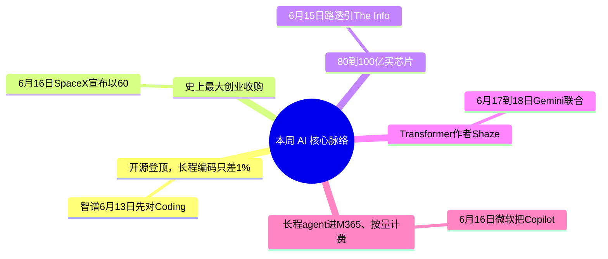

> **导语**：AI周报，一周AI脉络。这期十九条，不按流水账，先看五条主线。

---

## 🗺️ 本周主线脉络

---

## 🌟 核心深度剖析（5 大重磅事件）

### 01. [GLM-5.2：开源登顶，长程编码只差1%](https://z.ai/blog/glm-5.2)
- **发布主体**：Zhipu / Artificial Analysis · 06/16
- **核心事实**：智谱6月13日先对Coding Plan放出GLM-5.2，16日按MIT协议开源全部权重，上线HuggingFace的zai-org仓库。753B参数MoE、约40B激活、1M上下文，新架构IndexShare在百万上下文下把每token的浮点运算压到约2.9倍更省。Artificial Analysis智能指数v4.1拿到51分，列开源权重第一，越过MiniMax-M3、DeepSeek V4 Pro和Kimi K2.6。
- **行业影响**：长程编码这条线上，开源和闭源的差距收到一个百分点：FrontierSWE这种数小时到数十小时的真实工程项目，GLM-5.2约74.4分，只落后Claude Opus 4.8约1%、反超GPT-5.5。Simon Willison直接称它是最强的纯文本开源权重模型。代价是token用得凶——单任务平均约4万3千输出token；纯推理类考试也仍落后头部。19日Unsloth把它量化压掉84%体积，本地机器就能跑。
- **实操与避坑建议**：长程编码和agent工作流值得把GLM-5.2纳入候选——权重开放、可自部署、成本约头部闭源的几分之一；但要按真实代码库测它的token消耗，verbose会吃掉一部分价格优势，别只看榜单分数。

---

### 02. [SpaceX 600亿吞Cursor：史上最大创业收购](https://www.reuters.com/legal/transactional/spacex-buy-anysphere-60-billion-2026-06-16/)
- **发布主体**：Reuters / WSJ · 06/16
- **核心事实**：6月16日SpaceX宣布以600亿美元全股票收购Cursor母公司Anysphere，是有史以来最大的创业公司收购。这笔交易行使的是今年4月就锁定的call option——要么600亿买下、要么100亿买合作。Cursor年化收入约26到40亿美元；交易后算力从Anthropic、OpenAI迁到xAI的Colossus集群，号称百万张H100当量。xAI已在2月并入SpaceX。
- **行业影响**：编码agent是AI里少数已经大规模产生真实收入的方向，巨头开始直接买入口和数据。对开发者来说，Cursor短期继续运营、还会更快更强，但底层模型和数据流将转向xAI；企业客户面临大约半年的重新评估窗口——数据留存、模型中立性、供应商身份都变了。
- **实操与避坑建议**：用Cursor的团队不用立刻搬家，但要把『供应商可能换底座』写进风险评估——尤其有数据零留存、模型中立要求的，提前确认迁到Colossus之后的合规口径。

---

### 03. [高通洽购Tenstorrent：80到100亿买芯片](https://www.reuters.com/technology/qualcomm-talks-buy-tenstorrent-information-reports-2026-06-15/)
- **发布主体**：Reuters / The Information · 06/15
- **核心事实**：6月15日路透引The Information报道，高通正洽谈以80到100亿美元收购AI芯片公司Tenstorrent——后者由传奇芯片架构师Jim Keller执掌，走RISC-V路线。报道口径是价格未定、谈判进行中、未必成交。
- **行业影响**：这是本周『巨头收编』的另一面：上有SpaceX买开发者入口，下有高通买训练和推理芯片。AI的竞争在两端同时收口——算力上游和应用入口都在被有现金的巨头并购。NVIDIA同周还横扫了MLPerf Training v6.0的训练榜。
- **实操与避坑建议**：对国内团队没有直接采购影响，但要读这个趋势：非NVIDIA的芯片路线正在被并购整合，未来两年『多元算力供给』可能比现在更集中——别假设替代芯片会一直便宜可得。

---

### 04. [Transformer作者Shazeer离开谷歌投OpenAI](https://www.cnbc.com/2026/06/18/google-gemini-co-lead-noam-shazeer-leaves-for-openai.html)
- **发布主体**：CNBC / Axios · 06/18
- **核心事实**：6月17到18日，Gemini联合负责人、Transformer论文共同作者Noam Shazeer离开谷歌、加盟OpenAI。Shazeer在2024年随Character.AI以约27亿美元的deal回流谷歌、出任Gemini技术核心，如今转投OpenAI，被普遍视作OpenAI在人才战上的一次重大胜利。
- **行业影响**：这把『Transformer八位作者』这条线又拨动一格——多数原作者早已散到各家，最核心的几个还在头部之间流动。配合本周SpaceX吞Cursor、高通谈购Tenstorrent，AI的竞争正从模型层下沉到对人和算力的争夺。
- **实操与避坑建议**：值得关注的不是某个人的去向，而是信号：当顶尖研究者在头部之间流动，短期内各家旗舰的技术路线会更趋同——别把『某家独有的架构优势』当成长期护城河。

---

### 05. [Copilot Cowork转GA：长程agent进M365、按量计费](https://www.microsoft.com/en-us/microsoft-365/blog/2026/06/16/copilot-cowork-is-now-generally-available/)
- **发布主体**：Microsoft · 06/16
- **核心事实**：6月16日微软把Copilot Cowork从Frontier预览转为全量上线——一个能跨M365和连接系统跑复杂、多步、长时间任务的agent系统，按Copilot Credits用量计费。同周xAI把Grok塞进Word和PowerPoint、OpenAI给Codex上Record&Replay，演示一遍工作流就沉淀成可复用技能。
- **行业影响**：agent从『聊天框里答问题』转向『后台把多步活干完』，并且第一次被微软放进主力办公套件的默认能力位、按用量收费。三家在同一周抢『agent进生产工具』这个位置，办公软件正变成agent的入口层。
- **实操与避坑建议**：评估办公agent别只看演示，盯两件事：用量计费下的真实月成本怎么走，以及它在自己业务上的失败率——长任务一步错就满盘错，可观测和可回滚比花哨demo更重要。

---

## ⚡ 全景快讯扫读

### 📌 产品 · 其余

- **[Grok进Office](https://x.ai/news)**：Grok做Word/PowerPoint免费插件、上Bedrock和Databricks、Grok 4.3带1M上下文，还更新Imagine Video 1.5 *(xAI)*
- **[Meta AI Mode](https://techcrunch.com/2026/06/15/metas-new-ai-mode-on-facebook-pulls-from-public-info-across-its-platforms/)**：Facebook上AI Mode：用Meta AI综合全平台公开帖子做自然语言搜索、不再只给链接——UGC可靠性受质疑 *(TechCrunch)*
- **[Codex Record&Replay](https://developers.openai.com/codex/changelog)**：OpenAI给Codex上Record&Replay：macOS上把演示过的工作流直接变成可复用skill *(OpenAI)*
- **[Framer 3.0](https://www.framer.com/blog/ai-credits-simpler-plans-and-lower-prices/)**：把 Agent 搬上设计画布，并可通过外部 Agent 工作流接入 Claude Code、Cursor 或 Codex，在画布上设计、写作、分析和整理站点 *(Framer)*

### 📌 开源 · 其余

- **[Unsloth量化](https://huggingface.co/unsloth/GLM-5.2-GGUF)**：Unsloth 放出 GLM-5.2 的 GGUF 量化版本；不同量化档位对内存、体积和精度的取舍差别很大，部署前需要按自己的硬件实测 *(Unsloth/Hugging Face)*
- **[agent-skills](https://github.com/trending?since=weekly)**：addyosmani的AI编码技能库，把agent常用技能和提示词收成一处——GitHub周榜涨星猛 *(GitHub趋势)*
- **[LMCache](https://github.com/LMCache/LMCache)**：主打LLM的KV缓存管理：长上下文场景省显存、提吞吐——持续霸榜GitHub周趋势 *(GitHub趋势)*

### 📌 论文 · 其余

- **[世界模型推断](https://arxiv.org/abs/2606.16576)**：用自动机学习测agent能否推断环境的世界模型：推理模型更强，但规划和证据整合反复出错 *(arXiv)*
- **[FastContext](https://arxiv.org/abs/2606.14066)**：把『探索代码库』和『解题』拆两步、用专用小模型先探索后求解——给编码agent省token还提解决率 *(arXiv)*
- **[VibeThinker-3B](https://arxiv.org/abs/2606.16140)**：3B小模型靠靶向训练，在数学/代码/科学等可验证任务上拿强结果——挑战纯堆规模 *(arXiv)*

### 📌 行业与人事 · 其余

- **[Baseten 15亿](https://techcrunch.com/2026/06/18/ai-inference-startup-baseten-reportedly-raising-1-5b-months-after-its-last-mega-round/)**：推理基础设施公司接近完成约15亿美元融资、估值约130亿，距上轮才几个月——推理需求暴涨信号 *(TechCrunch)*
- **[MLPerf v6.0](https://mlcommons.org/benchmarks/training/)**：NVIDIA Blackwell横扫训练榜、最高8192卡——MoE和稀疏模型训练成新基准 *(MLCommons)*
- **[HPE AI Factory](https://www.hpe.com/us/en/newsroom/press-release/2026/06/hpe-brings-agentic-ai-into-production-with-nvidia-delivering-security-governance-scale-and-sovereignty.html)**：HPE 在 Discover 大会上扩展与 NVIDIA 共建的 AI Factory，重点补上 Agent 的安全、治理、可观测性和主权部署能力 *(HPE)*
- **[AI没取代工程师](https://simonwillison.net/2026/jun/14/)**：Simon Willison：AI还没、也不会取代软件工程师——软件工程对AI既适配又有韧性 *(Simon Willison)*

---

## 🎯 下周继续盯什么
