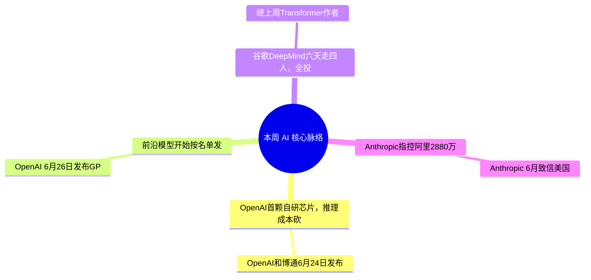

> **导语**：AI周报，一周AI脉络。这期十四条，不按流水账，先看四条主线。

---

## 🗺️ 本周主线脉络

---

## 🌟 核心深度剖析（4 大重磅事件）

### 01. [Jalapeño：OpenAI首颗自研芯片，推理成本砍半](https://openai.com/index/openai-broadcom-jalapeno-inference-chip/)
- **发布主体**：OpenAI / Broadcom · 06/24
- **核心事实**：OpenAI和博通6月24日发布首颗自研AI芯片Jalapeño，专为大模型推理、不是训练；从概念到流片只用9个月，TSMC代工、博通供网络互连。实验室测试里，每token推理成本约比当代英伟达GPU低50%，性能对标Blackwell和谷歌TPU。
- **行业影响**：推理是AI的『日账单』所在——OpenAI 2025年光服务ChatGPT就花了约140亿美元。把单token推理成本砍一半，是决定能否盈利的杠杆，不是边际优化。芯片2026年底小批量、2027量产，OpenAI与微软等承诺到2029部署10吉瓦自研加速器。英伟达训练仍稳(消息当天只跌0.26%)，但推理这块正被定制芯片蚕食。
- **实操与避坑建议**：别急着唱衰英伟达——训练仍是它的护城河；真正值得跟的是推理芯片这条线：未来一两年自研ASIC、TPU、Trainium会把推理单价继续往下压，长期看API推理报价有下行空间。

---

### 02. [GPT-5.6限受信：前沿模型开始按名单发](https://www.cnbc.com/2026/06/26/openai-limits-new-ai-models-to-trusted-partners-request-us-government.html)
- **发布主体**：OpenAI / CNBC · 06/26
- **核心事实**：OpenAI 6月26日发布GPT-5.6三件套——Sol是新旗舰、比GPT-5.5上一个台阶，Terra对标5.5但成本低一半，Luna更小更省，上下文升到150万token。但初期只通过API和Codex对一小撮『受信合作伙伴』开放，官方说这是应美国政府要求。
- **行业影响**：这是两周前Anthropic Fable 5出口管制的续集：前沿模型不再默认人人可用，而是按『受信名单』发。两周内两家头部实验室的最强模型都先对一小圈人开放——能力和访问权第一次被国家安全框架直接框住。
- **实操与避坑建议**：对国内团队的含义更确定了：最强一档模型的可得性正系统性收紧，关键工作流别押单一前沿闭源模型——多模型路由加开源权重备份，从加分项变成默认项。

---

### 03. [谷歌DeepMind六天走四人，全投Anthropic](#)
- **发布主体**：Bloomberg / TechCrunch · 06/24
- **核心事实**：继上周Transformer作者Shazeer投OpenAI后，谷歌DeepMind六天内又走三位核心、全部投奔Anthropic：诺奖得主、AlphaFold负责人John Jumper(6月20)，AI编码负责人Jonas Adler，预训练专家Alexander Pritzel(6月24)。等于AlphaFold核心团队整建制迁移。
- **行业影响**：Bloomberg揭了内因：Shazeer出走前，他项目的算力被调去伦敦团队。在前沿实验室，算力就是研究速度的硬约束。Anthropic和OpenAI能给、谷歌给不了的，是IPO前股权加上真能拿到的算力。六天四人、还叠加Gemini 3.5 Pro跳票，谷歌的叙事在恶化。
- **实操与避坑建议**：信号比个人去向更重要：当顶尖研究者集中流向两家、且都在补编码和科学，短期内各家旗舰路线会更趋同——别把『某家独有的人才或架构优势』当成长期护城河。

---

### 04. [Anthropic指控阿里2880万次蒸馏攻击](#)
- **发布主体**：Anthropic / CNBC · 06/25
- **核心事实**：Anthropic 6月致信美国参议院银行委员会、本周披露：指控阿里巴巴及其通义关联方发起史上最大蒸馏攻击——称对方在4月22到6月5日用约2.5万个伪账号、对Claude跑了2880万次对话，专挖Mythos Preview的agent、编码和长程能力，并指中国政府介入。
- **行业影响**：先说清楚定性：这是Anthropic单方面的指控，目前没有公开的第三方实锤，阿里巴巴尚未回应。所谓蒸馏，是用海量问答对去逼近强模型的『行为』，并不偷代码或权重。Anthropic今年2月也用同样方式指控过DeepSeek、月之暗面、MiniMax(称约1600万次)。能确定的是另一件事：阿里同期还在起诉五角大楼的『军方公司』认定——中美AI在数据和供应链上的对立在升级。
- **实操与避坑建议**：把它当一桩『指控』、而不是定案来跟：在有第三方证据前，别据此就认定某个开源模型『被污染』或不安全。真要选型，仍按自己的实测、许可证和合规要求来——别让一封指控信替你做技术判断。

---

## ⚡ 全景快讯扫读

### 📌 模型与产品 · 其余

- **[Gemini Deep Think](#)**：谷歌6月22日上线Gemini 2.5 Pro Deep Think刷强推理分；但3.5 Pro正式版跳票到7月——叠加人才出走势头受挫 *(Google)*
- **[GPT-5.5-Cyber](#)**：OpenAI与Jalapeño同日发面向网络防御的专用模型——对应Anthropic的安全线 *(OpenAI)*
- **[Fable 5返回](#)**：从出口管制返回但转入用量计费付费墙、分类器收紧——某些提示回退Opus 4.8，实际可用能力可能低于基准 *(Anthropic)*

### 📌 开源与基准 · 其余

- **[DeepSeek永久降价](#)**：V4-Pro降价转永久、比GPT-5.5输入低5倍；而前沿闭源齐涨价(GPT-5.5翻倍)——一边涨一边降，中国开源立价格地板 *(DeepSeek)*
- **[FrontierCode](#)**：Cognition新编码基准测PR是否『生产可用』：Fable 5领先46.3分 > Opus 4.8 34.3 > GPT-5.5 25.5 *(Cognition)*
- **[编码市场93亿](#)**：Mordor估AI编码工具2026约$93亿、年增26%：Claude Code约40%、Codex约21%——企业刻意只签一年 *(Mordor)*

### 📌 行业与人事 · 其余

- **[阿里诉五角大楼](#)**：起诉美国防部、要求撤销『中国军方公司』认定——同名单含百度/比亚迪/宇树等191实体，与蒸馏指控双重承压 *(Reuters)*
- **[Broadcom造王者](#)**：定制AI硅背后都是博通：谷歌TPU/OpenAI Jalapeño/Meta MTIA/字节谈判中——推理被ASIC蚕食 *(CNBC)*
- **[2月也指控三家](#)**：蒸馏指控非首次：2月Anthropic也对DeepSeek/月之暗面/MiniMax提过、称约1600万次——但同样未经第三方证实 *(Anthropic)*
- **[Seedcamp 3.2亿](#)**：欧洲老牌早期基金募3.2亿美元新基金、进军美国——AI早期投资仍热 *(TechCrunch)*

---

## 🎯 下周继续盯什么
