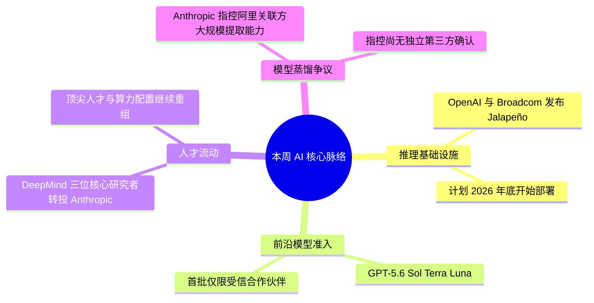

> **导语**：本周的共同主题不是单纯的模型跑分，而是能力背后的控制权：谁掌握推理芯片，谁能拿到前沿模型，谁能留住关键研究者，以及模型能力能否被合规地迁移。

---

## 🗺️ 本周主线脉络

---

## 🌟 四条核心事件

### 01. [OpenAI 与 Broadcom 发布首款自研推理芯片 Jalapeño](https://openai.com/index/openai-broadcom-jalapeno-inference-chip/)

- **发布主体**：OpenAI / Broadcom · 2026-06-24
- **核心事实**：Jalapeño 是 OpenAI 首款面向大模型推理设计的 Intelligence Processor，由 OpenAI 负责架构设计，Broadcom 提供芯片实现、网络与连接技术，Celestica 参与板卡、机架和系统集成。官方称项目从设计推进到生产准备阶段用了九个月，并计划在 2026 年底开始初步部署。
- **证据边界**：官方只披露“每瓦性能显著优于当前前沿水平”，没有公布可独立复核的单 Token 成本降幅。因此不能把“推理成本砍半”写成已经证实的普遍结论。
- **行业影响**：自研 ASIC 的价值在于围绕模型、内核、服务系统和机架做全栈协同。它不会立即替代通用 GPU，但会改变超大规模推理负载的长期成本结构。
- **实操建议**：企业选型时继续以真实吞吐、延迟、可用性和总体拥有成本为准，不根据厂商尚未公开的内部测试数字预判 API 价格。

---

### 02. [GPT-5.6 开始限量预览：前沿模型首次按受信名单开放](https://openai.com/index/previewing-gpt-5-6-sol/)

- **发布主体**：OpenAI · 2026-06-26
- **核心事实**：OpenAI 预览 GPT-5.6 系列，包括旗舰模型 Sol、均衡型 Terra 和低成本 Luna。官方称 Terra 在接近 GPT-5.5 能力的同时成本低一半，并为 Sol 引入更高的 `max` 推理强度与多智能体 `ultra` 模式。
- **准入机制**：预览期仅通过 API 和 Codex 向一小组受信合作伙伴开放。OpenAI 表示，这一安排来自其与美国政府的协调，同时强调不希望它成为长期默认机制，并计划随后扩大开放。
- **行业影响**：模型能力之外，“是否能稳定获得访问权”开始成为架构风险。依赖单一闭源模型的关键流水线，需要重新评估地区、账户、合规和供应连续性。
- **实操建议**：生产系统保留多模型路由、降级策略和开源权重备份，并将模型替换回归测试纳入发布门禁。

---

### 03. [DeepMind 三位核心研究者转投 Anthropic](https://techcrunch.com/2026/06/24/ai-researchers-continue-to-leave-google-for-its-rivals/)

- **来源主体**：TechCrunch 引述 Bloomberg · 2026-06-24
- **核心事实**：报道显示，Jonas Adler 与 Alexander Pritzel 计划从 Google 转投 Anthropic；数日前，诺贝尔奖得主、AlphaFold 关键研究者 John Jumper 也宣布加入 Anthropic。此前 Noam Shazeer 则离开 Google 前往 OpenAI。
- **证据边界**：公开报道能够确认的是人员去向，无法据此断言某个团队已“整建制迁移”，也不能仅凭人事变化推导具体模型延期原因。
- **行业影响**：前沿实验室的竞争已经同时覆盖研究人才、计算资源和股权激励。对外部开发者而言，单次人员流动是信号，但持续交付、产品可用性和生态稳定性更值得长期观察。

---

### 04. [Anthropic 指控阿里关联方大规模提取 Claude 能力](https://www.reuters.com/world/china/anthropic-says-alibaba-illicitly-extracted-claude-ai-model-capabilities-2026-06-24/)

- **来源主体**：Anthropic 致美国参议员信函 / Reuters · 2026-06-24
- **核心事实**：Anthropic 指控与阿里巴巴及 Qwen 实验室有关联的操作者，在 2026 年 4 月 22 日至 6 月 5 日期间，通过近 2.5 万个欺诈账户与 Claude 进行超过 2880 万次交互，用于提取软件工程、智能体推理等能力。
- **证据边界**：这些数字来自 Anthropic 的单方指控。报道发布时，阿里巴巴尚未公开回应，也没有独立第三方完成技术归因，因此应把它称为“指控”，而不是已经定案的攻击事实。
- **背景**：Anthropic 在 2 月曾公开指控 DeepSeek、Moonshot 与 MiniMax 通过约 2.4 万个欺诈账户产生超过 1600 万次交互。模型蒸馏本身是常见训练方法，争议焦点在于访问授权、服务条款和能力提取方式。
- **实操建议**：模型提供方需要加强异常账户聚类、速率控制和跨账户行为检测；使用方则应审查训练数据来源、API 条款与模型许可证，避免把未经授权的输出直接纳入训练管线。

---

## ⚡ 两条延伸信号

- **[Anthropic 公开其蒸馏攻击检测方法](https://www.anthropic.com/news/detecting-and-preventing-distillation-attacks)**：官方披露了账户协同、请求元数据、基础设施指标和提示模式等归因信号，也再次说明“蒸馏技术”与“未经授权的能力提取”不是同一个概念。
- **[Seedcamp 募集 3.2 亿美元新基金](https://techcrunch.com/2026/06/22/seedcamp-raises-320m-for-its-new-fund-to-expand-its-us-footprint/)**：这家长期聚焦欧洲早期项目的基金计划扩大美国布局，说明 AI 创业投资仍在跨区域寻找项目和退出机会。

---

## 🎯 接下来继续盯什么

1. **Jalapeño 的真实部署数据**：关注初步部署后的吞吐、能效、可靠性和成本，而不是未经公开验证的降本口号。
2. **GPT-5.6 的开放范围**：观察受信预览何时转为普遍可用，以及不同地区和产品入口是否保持一致。
3. **模型蒸馏的证据标准**：关注是否出现可供第三方复核的技术材料、当事方回应及服务条款层面的后续处理。

## 相关观看入口

- [Bilibili：AI 周报 VOL.27](https://www.bilibili.com/video/BV1UpTN67ES1/)

> 资料核验日期：2026-08-23。涉及人事与争议性事件均保留报道来源和证据边界。
