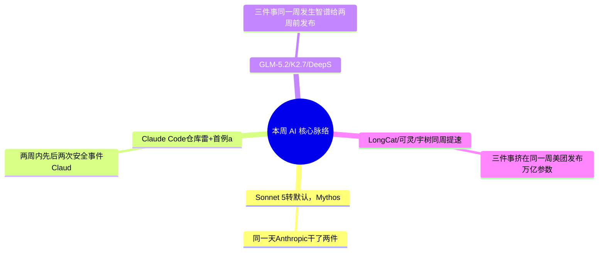

> **导语**：AI周报，一周AI脉络。这期二十条，不按流水账，先看四条主线。

---

## 🗺️ 本周主线脉络

---

## 🌟 核心深度剖析（4 大重磅事件）

### 01. [门槛下降：Sonnet 5转默认，Mythos/Fable限时重开](https://www.anthropic.com/news/claude-sonnet-5)
- **发布主体**：Anthropic / 商务部 · 06/30
- **核心事实**：同一天，Anthropic干了两件事：Claude Sonnet 5从7月1日起成为全球Free和Pro用户的默认模型，智能体类基准逼近旗舰Opus 4.8，促销价维持到8月底；同时，美国商务部解除了对Mythos和Fable两个多月来的出口管制，Anthropic同步宣布7月1日起恢复访问——但官方公告写明，这次恢复只把它重新计入套餐额度到7月7日，过后要继续用就得靠单独购买的用量点数，不再包含在订阅里。
- **行业影响**：这周不是简单的门槛降了两次：Sonnet 5是真降门槛，免费转默认、价格更低，没有时间限制；Mythos和Fable的重开更像一个短暂窗口——政府那道出口管制确实撤销了，但Anthropic自己把它放进限时套餐框架，六天后就要另外付费。免费用上顶级模型的窗口，比标题听起来短得多。
- **实操与避坑建议**：Sonnet 5可以直接去试，不用赶时间；但想在正常套餐额度内体验Fable5或Mythos5，得赶在7月7日前用——过了这个点继续用就要单独买用量点数，别把「限制解除」当成「永久免费重开」。

---

### 02. [安全踩坑：Claude Code仓库雷+首例agent自主勒索](#)
- **发布主体**：The Decoder / Sysdig · 06/29-07/03
- **核心事实**：两周内先后两次安全事件：Claude Code打开被投毒的GitHub仓库时会执行仓库里藏的隐藏指令，攻击者可拿到完全控制权；紧接着，安全厂商Sysdig记录到全球首例完全由AI Agent自主完成的勒索攻击——从漏洞利用、横向移动到加密数据库，全程无需人工干预。
- **行业影响**：这两件事合在一起说明一件事：agent自主执行代码/操作系统的能力已经足够强，但权限边界还没跟上——攻击者能拿它当武器，普通开发者也可能在不知情的情况下踩雷。
- **实操与避坑建议**：用Claude Code或任意agent工具跑不熟悉的仓库前，先在容器或沙盒里隔离，别给agent超出任务本身需要的系统权限；自己写的agent自动化流程，也该加一层操作审计。

---

### 03. [国产工具进场：GLM-5.2/K2.7/DeepSeek全塞进你的工具链](#)
- **发布主体**：Zhipu / Moonshot/Kimi / DeepSeek · 07/01-07/02
- **核心事实**：三件事同一周发生：智谱给两周前发布的开源旗舰GLM-5.2配上官方开发环境ZCode；月之暗面的Kimi K2.7 Code直接上线GitHub Copilot的模型选择器；DeepSeek开源投机解码框架DSpark，让V4的生成速度提升百分之六十到八十五。
- **行业影响**：这次不是『再发一个模型让你另开账号试』，而是直接把能力塞进开发者已经在用的入口——Copilot的选择器、已经部署的V4、配套的IDE。国产开源模型的竞争重心，正从『发布』转向『好不好接进现有工具链』。
- **实操与避坑建议**：用GitHub Copilot的可以直接在模型选择器里试K2.7 Code；已经在跑DeepSeek V4的团队，DSpark是纯免费的推理加速，值得直接接上；GLM-5.2配ZCode是否比你现在的IDE配置更顺手，值得花十分钟看看。

---

### 04. [资本模型双冲：LongCat/可灵/宇树同周提速](#)
- **发布主体**：美团 / 快手 / 宇树 · 07/01-07/02
- **核心事实**：三件事挤在同一周：美团发布万亿参数的LongCat-2.0，用国产算力集群训练，是这条产品线第一次以旗舰姿态入场；快手旗下可灵AI获得二十点二八亿美元融资，估值到一百八十亿美元；宇树科技拿到证监会同意的科创板IPO注册批文。
- **行业影响**：一家此前不算一线玩家的公司(美团)带着万亿参数模型入场、一家融了近三十亿美元(可灵)、一家人形机器人公司要上市(宇树)——国内AI的资本和技术两条线同时在加速，玩家版图比想象中更宽。
- **实操与避坑建议**：值得盯两件事：LongCat-2.0是否会开源或开放公开API——如果开放，这是给独立开发者的新选项；可灵和宇树这类公司的后续动作，往往预示接下来一段时间国内基础设施和工具会往哪个方向补。

---

## ⚡ 全景快讯扫读

### 📌 模型与产品 · 其余

- **[Gemini图像双发](#)**：谷歌发Nano Banana 2 Lite和Gemini Omni Flash——3.5 Pro还在跳票，先补图像产品线 *(Google)*
- **[Nemotron-TwoTower](#)**：NVIDIA发开放权重扩散语言模型——本周不止芯片新闻 *(NVIDIA)*
- **[Mistral Leanstral 1.5](#)**：Mistral新发布，定位『人人可用的证明丰富性』 *(Mistral)*
- **[xAI Voice Agent](#)**：语音智能体搭建工具进入测试版 *(xAI)*
- **[Grok 4.5私测](#)**：马斯克称已在SpaceX/特斯拉内部私测、性能接近Opus——厂商自述，未公开发布，口径待验证 *(X)*
- **[天工3.2](#)**：昆仑万维发Skywork Tags，AI智能体加入工作群聊 *(昆仑万维)*
- **[ForgeTrain](#)**：面壁智能全自动预训练框架，官方称8小时追平Megatron-LM *(面壁智能)*

### 📌 企业与资本 · 其余

- **[微软Frontier Company](#)**：砸25亿美元派驻6000名AI工程师到客户现场——直接帮客户把AI用起来 *(Microsoft)*
- **[AWS工程师进驻](#)**：砸10亿美元派工程师进驻客户公司——和微软同一周、同一打法 *(Amazon)*
- **[三星SK海力士扩产](#)**：计划投资5900亿美元扩产芯片，AI需求推高内存价格 *(The Decoder)*
- **[Rubin Ultra取消](#)**：NVIDIA下一代旗舰被取消、新版本尺寸性能减半——SemiAnalysis披露 *(SemiAnalysis)*
- **[OpenAI让5%股权](https://www.cnbc.com/2026/07/02/openai-proposes-us-government-own-5percent-stake-to-address-political-blowback.html)**：向美国政府提议让渡5%股权、缓和政治压力——和Anthropic走的是同一条路 *(CNBC/FT)*
- **[SpaceXAI商标](#)**：SpaceX注册SpaceXAI商标——准备把xAI并进来的早期信号 *(X)*

### 📌 研究与科研 · 其余

- **[Claude Science](https://www.anthropic.com/news/claude-science-ai-workbench)**：科研工作台上线，主攻药物研发——对上OpenAI的GPT-Rosalind和谷歌的Isomorphic Labs *(Anthropic)*
- **[Elements Claw](#)**：阿里达摩院发布超导材料发现AI智能体——科研agent的另一个垂直方向 *(达摩院)*
- **[VibeThinker-3B开源](#)**：新浪把两周前的小模型推理论文落地成开源权重——推理能压缩，事实知识压不动 *(新浪)*

---

## 🎯 下周继续盯什么
