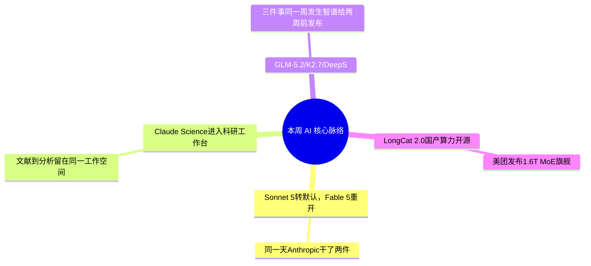

> **导语**：AI周报，一周AI脉络。这期只保留五条可以回到公开来源核验的消息，先看四条主线。

---

## 🗺️ 本周主线脉络

---

## 🌟 核心深度剖析（4 大重磅事件）

### 01. [门槛调整：Sonnet 5 转默认，Fable 5 恢复全球访问](https://www.anthropic.com/news/redeploying-fable-5)
- **发布主体**：Anthropic · 06/30
- **核心事实**：Anthropic 宣布恢复 Claude Fable 5 的全球访问，并从 7 月 1 日起陆续开放 Claude Platform、Claude.ai、Claude Code 和 Claude Cowork。Mythos 5 的恢复范围更窄，只面向获批机构，不能把两者笼统理解成同时全面重开。同期 Sonnet 5 成为 Claude Free 和 Pro 用户的默认模型。
- **行业影响**：前沿模型的可用性不再只取决于模型有没有发布，还取决于安全评估、监管范围、账户类型和计费政策。把单一型号写死进生产流程，风险越来越高。
- **实操与避坑建议**：关键流程保留模型切换能力，并在接入前重新确认地区、账户和 API 的实际可用范围；公告里的“恢复访问”不等于所有用户、所有入口都拥有相同权限。

---

### 02. [Claude Science：把科研 Agent 放进统一工作台](https://www.anthropic.com/news/claude-science-ai-workbench)
- **发布主体**：Anthropic · 本周
- **核心事实**：Anthropic 发布 Claude Science 工作台，面向生命科学研究，把文献检索、数据分析、代码执行与协作放进同一环境。
- **行业影响**：科研类 Agent 的竞争点正从“回答专业问题”转向“能否在可追溯的工作空间里连接资料、分析过程和最终结论”。
- **实操与避坑建议**：涉及实验、医学或药物研发时，保留原始数据、检索出处和分析日志；模型产出的假设只能作为研究输入，不能替代专家复核。

---

### 03. [国产工具进场：GLM-5.2、K2.7 与 DeepSeek 进入开发工具链](https://github.blog/changelog/2026-07-01-kimi-k2-7-is-now-available-in-github-copilot/)
- **发布主体**：Zhipu / Moonshot/Kimi / DeepSeek · 07/01-07/02
- **核心事实**：三件事在相近时间发生：智谱为 [GLM-5.2](https://z.ai/blog/glm-5.2) 配套 ZCode；Kimi K2.7 Code 上线 GitHub Copilot 模型选择器，成为其中首个可选的开放权重模型；DeepSeek 发布 [DSpark](https://arxiv.org/abs/2607.05147) 投机解码方法，用于降低 V4 服务中的验证浪费。
- **行业影响**：这次不是『再发一个模型让你另开账号试』，而是直接把能力塞进开发者已经在用的入口——Copilot的选择器、已经部署的V4、配套的IDE。国产开源模型的竞争重心，正从『发布』转向『好不好接进现有工具链』。
- **实操与避坑建议**：用 GitHub Copilot 的团队可先在非关键仓库对比 K2.7 Code；自部署 DeepSeek 的团队则要在自己的并发量、上下文和硬件组合上验证 DSpark，论文中的加速不能直接当成生产承诺。

---

### 04. [LongCat-2.0：国产算力训练的万亿参数模型](https://www.meituan.com/news/NN260630164005904)
- **发布主体**：美团 · 06/30
- **核心事实**：美团发布 LongCat-2.0，并宣布对外开源。官方披露模型总参数 1.6T、平均激活约 48B、原生支持 1M 上下文，训练与推理全流程运行在五万卡国产算力集群上。
- **行业影响**：这次值得关注的不只是参数规模，而是国产算力完成大规模预训练、推理和开源交付的完整闭环，为开发者增加了新的自部署候选。
- **实操与避坑建议**：先看许可证、推理栈和实际硬件门槛，再看榜单。万亿参数即使是 MoE，也不等于普通工作站能够低成本运行；优先通过公开 API 或小规模评测验证任务适配度。

---

## ⚡ 全景快讯扫读

### 📌 企业与资本 · 其余

- **[OpenAI提议5%政府持股](https://www.cnbc.com/2026/07/02/openai-proposes-us-government-own-5percent-stake-to-address-political-blowback.html)**：OpenAI 提议由美国政府持有 5% 股权，以缓和政治压力；该方案仍是提议，不是已经完成的交易 *(CNBC/FT)*

---

## 🎯 下周继续盯什么
