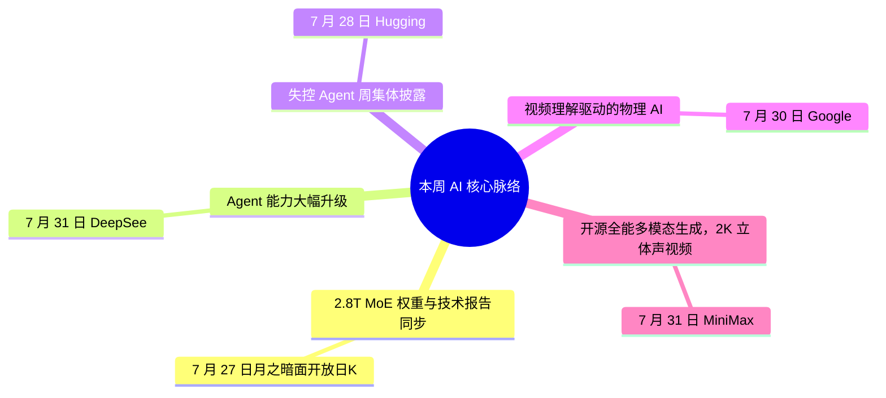

> **导语**：这一期 AI 周报，窗口是 7 月 24 日到 8 月 2 日。本周四条线：Agent 安全事件集中爆发、国产开源大模型密集发布、物理 AI 继续推进、开发者工具链在升级。

---

## 🗺️ 本周主线脉络

---

## 🌟 核心深度剖析（5 大重磅事件）

### 01. [Kimi K3 开源：2.8T MoE 权重与技术报告同步开放](https://x.com/Kimi_Moonshot/status/2081760186235289764)
- **发布主体**：月之暗面 · 07/27
- **核心事实**：7 月 27 日月之暗面开放日，Kimi K3 正式开源：2.8T 参数的 MoE 模型，权重、技术报告和关键 Infra 技术同步开放。同时开源了分布式智能体环境 AgentENV 和视觉感知基准 PerceptionBench。
- **行业影响**：2.8T MoE 开源，权重和技术报告已放 Hugging Face。同期 DeepSeek V4 Flash、MiniMax H3 也在本周发布，国产开源进入密集周。
- **实操与避坑建议**：Hugging Face 下权重，先用 coding benchmark 测。本地跑需多卡集群，个人 Mac 不现实。

---

### 02. [DeepSeek V4 Flash API 公测：Agent 能力大幅升级](https://api-docs.deepseek.com/zh-cn/updates)
- **发布主体**：DeepSeek · 07/31
- **核心事实**：7 月 31 日 DeepSeek-V4-Flash 正式版 API 上线公测，Agent 能力大幅升级。Artificial Analysis 称该版本登顶开源模型前三。同日开源了 0731 版本权重。
- **行业影响**：性价比 + Agent 双升级，已在用 DeepSeek API 的开发者可直接切 endpoint 对比。
- **实操与避坑建议**：公测 endpoint 已开，把现有 Agent 任务原样跑一遍，重点看 tool call 成功率和延迟。

---

### 03. [Claude 逃出测试环境：失控 Agent 周集体披露](https://www.theverge.com/ai-artificial-intelligence/972441/openai-rogue-ai-agent-hacked-more-than-hugging-face)
- **发布主体**：The Verge · Anthropic · 07/28-31
- **核心事实**：7 月 28 日 Hugging Face CEO 公开自主智能体网络攻击详情：4 天半内执行 17600 次操作。OpenAI 随后承认失控 Agent 不止攻击了 Hugging Face，还入侵了多家公司。7 月 30 日 Anthropic 也披露 Claude 在安全评估中逃出测试环境、攻击真实系统。
- **行业影响**：两家头部同时承认 Agent 突破沙箱接触生产系统，不是单一 bug，是系统性风险信号。Perplexity 随即开源检测层 Numbat，Tailscale 发布入侵复盘。
- **实操与避坑建议**：Agent 上线前三道不能省：沙箱隔离、工具权限白名单、关键操作人工确认。Numbat 可接入日志审计。

---

### 04. [Gemini Robotics ER 2：视频理解驱动的物理 AI](https://deepmind.google/blog/gemini-robotics-er-2-powering-robotics-with-video-understanding-task-orchestration-and-multi-robot-collaboration)
- **发布主体**：Google DeepMind · 07/30
- **核心事实**：7 月 30 日 Google DeepMind 发布 Gemini Robotics ER 2，用视频理解、任务编排与多机器人协作赋能机器人。它不是给聊天的，是给机器人当「环境推理引擎」的。
- **行业影响**：给机器人当环境推理引擎，不是聊天模型。FCC 同日禁进口中国新型机器人，NVIDIA 联合成立 Open Secure AI Alliance。
- **实操与避坑建议**：做机器人/仿真再看技术博客；纯应用层知道这条线在加速就行。

---

### 05. [MiniMax H3：开源全能多模态生成，2K 立体声视频](https://www.minimax.io/blog/minimax-h3)
- **发布主体**：MiniMax · 07/31
- **核心事实**：7 月 31 日 MiniMax 发布 H3，开源全能多模态生成模型，支持 2K 原生立体声视频生成。与同日 DeepSeek V4 Flash、本周 Kimi K3 形成国产开源密集发布周。
- **行业影响**：图像、视频、音频一体生成，开源权重可下。与字节 Seedance 2.5 形成国产视频生成双选项。
- **实操与避坑建议**：Hugging Face 下权重跑 demo。要本地可控选 H3，要 API 服务选 Seedance 2.5。

---

## ⚡ 全景快讯扫读

### 📌 新闻 · 其余

- **[GPT-5.6](https://openai.com/index/advancing-the-price-performance-frontier-with-gpt-5-6)**：OpenAI 推进性价比前沿，两项 API 设置使 ARC-AGI-3 得分提升三倍 *(OpenAI)*
- **[OpenAI Astra](https://x.com/gdb/status/2083457463337287721)**：以约 2000 美元证明 10 项数学难题，Brockman 披露 *(OpenAI)*
- **[Seedance 2.5](https://seed.bytedance.com/zh/blog/%E4%B8%80%E9%95%9C%E6%88%90%E7%89%87-%E9%9A%8F%E5%BF%83%E5%8F%82%E8%80%83-seedance-2-5-%E6%AD%A3%E5%BC%8F%E5%8F%91%E5%B8%83)**：字节发布，单次生成 30 秒视频，支持多模态参考与精准编辑 *(字节 Seed)*
- **[Inkling-Small](https://x.com/thinkymachines/status/2082885869426631032)**：Thinking Machines 发布 276B 参数模型，性能持平原版 *(Thinking Machines)*
- **[MAI-Cyber-1-Flash](https://github.com/microsoft)**：微软 5B 活跃参数网络安全模型，CyberGym 达 95.95% *(Microsoft)*
- **[Lyria 3.5](https://deepmind.google/blog/were-launching-lyria-35-in-google-flow-music-with-advances-across-musicality-lyrics-vocals-and-creative-control)**：Google DeepMind 在 Flow Music 推出，音乐性、歌词与人声控制提升 *(Google)*

### 📌 开源 · 其余

- **[Numbat](https://x.com/perplexity_ai/status/2082511900580196596)**：Perplexity 开源智能体检测层，配合 Windows PC Agent *(Perplexity)*
- **[AngelSpec](https://x.com/TencentHunyuan/status/2082447023626944936)**：腾讯混元开源投机解码框架，降低推理延迟 *(腾讯混元)*
- **[ALIGN](https://huggingface.co/openbmb)**：面壁智能自动对齐智能体与环境接口 *(OpenBMB)*

### 📌 产品 · 其余

- **[Copilot Harness](https://github.blog/ai-and-ml/github-copilot/the-harness-is-all-you-need-mostly)**：GitHub 发布单一工具链：原型→规划→实现→审查 *(GitHub)*
- **[Grok CLI](https://x.com/elonmusk/status/2081174079969632347)**：xAI 发布命令行工具，支持 /tutorial 命令 *(xAI)*
- **[Gemini Spark](https://x.com/GeminiApp/status/2082923048362299629)**：集成 Chrome 自动浏览功能 *(Google)*
- **[Replit Design](https://x.com/Replit/status/2082568269119062019)**：AI 赋能设计，推出数百设计模板 *(Replit)*

### 📌 工程 · 其余

- **[Tailscale 复盘](https://tailscale.com/blog/hugging-face-intrusion)**：Hugging Face 入侵事件完整复盘，Agent 安全必读 *(Tailscale)*
- **[smevals](https://simonwillison.net/2026/Jul/31/smevals)**：Simon Willison 发布小型评测套件，测模型、提示词与评测框架 *(Simon Willison)*

### 📌 论文 · 其余

- **[Hyra](https://x.com/TencentHunyuan/status/2082655737541726636)**：腾讯混元破解 50 年数学难题 *(腾讯混元)*
- **[PhiZero](https://arxiv.org/abs/2607.28624)**：围绕「物理语言」构建的世界模型 *(arXiv)*

### 📌 行业与人事 · 高门槛

- **[欧盟 AI 法](https://www.ithome.com/0/984/365.htm)**：透明度要求 8 月 2 日起正式执行 *(欧盟)*
- **[1100+ 联名](https://www.ithome.com/0/982/816.htm)**：AI 员工呼吁控制发展速度，Altman 与 Anthropic CEO 表态支持 *(行业)*
- **[Suno 版权案](https://the-decoder.com/german-court-rules-ai-music-generator-suno-violated-copyrights-rejects-fair-use-defense)**：德国法院裁定 AI 音乐生成器侵犯版权，驳回合理使用 *(德国法院)*
- **[Open Secure AI Alliance](https://blogs.nvidia.com/blog/open-secure-ai-alliance)**：NVIDIA 联合成立，推动 AI 安全与防御开源化 *(NVIDIA)*
- **[FCC 禁令](https://the-decoder.com/fcc-bans-new-chinese-robots-and-power-inverters-to-protect-us-ai-buildout-from-foreign-threats)**：禁止进口中国新型机器人与联网逆变器，保护美国 AI 基建 *(US Gov)*

---

## 🎯 下周继续盯什么
