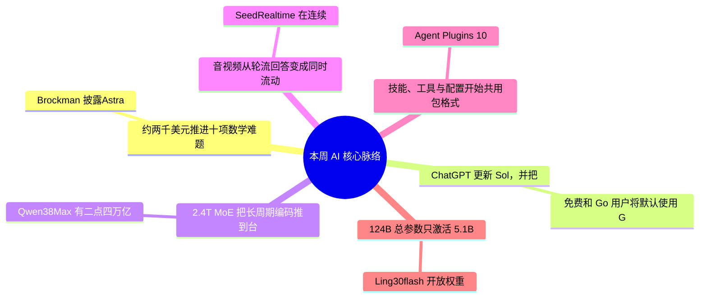

> **导语**：这一期 AI 周报，窗口是 8 月 1 日到 10 日。主线看四条：Astra 推进十项数学难题，ChatGPT 下沉免费入口，国产模型继续开放权重，实时多模态和 Agent 插件开始进入产品与标准。

---

## 🗺️ 本周主线脉络

---

## 🌟 核心深度剖析（6 大重磅事件）

### 01. [OpenAI Astra：约两千美元推进十项数学难题](https://x.com/gdb/status/2083457463337287721)
- **发布主体**：Greg Brockman / OpenAI · 08/01-07
- **核心事实**：Brockman 披露，Astra 以约两千美元推理成本，在数学和理论计算机科学上完成十项重要进展。OpenAI 随后因网络安全能力将其列为首个关键模型，并延缓发布。
- **行业影响**：这是多难题连续推进，不等于十项结果已经完成独立验证。
- **实操与避坑建议**：暂无公开入口。等完整证明和第三方验算，别拿宣传摘要替代科研结论。

---

### 02. [ChatGPT 更新 Sol，并把 Luna 推向免费默认](https://openai.com/index/improving-gpt-5-6-sol-in-chatgpt)
- **发布主体**：OpenAI · 08/06
- **核心事实**：免费和 Go 用户将默认使用 GPT-5.6 Luna，文本对话不限量，并增加 Think 按钮。付费用户的 Sol 则加入思考强度滑块。
- **行业影响**：这次只改 ChatGPT 对话体验，文件、图片仍有限额，Work、API 与 Codex 版本不变。
- **实操与避坑建议**：免费用户直接试；已有工作流只复测事实问答和格式遵循，不用迁移 API 模型。

---

### 03. [Qwen3.8-Max：2.4T MoE 把长周期编码推到台前](https://qwen.ai/blog?id=qwen3.8)
- **发布主体**：Qwen · 08/03
- **核心事实**：Qwen3.8-Max 有二点四万亿总参数、九百五十亿激活参数，并展示连续十天以上自主开发。Max 与二百七十亿参数版预告下周开放权重。
- **行业影响**：当周仍以 API 可用为主，权重、许可证和部署成本都还没落地。
- **实操与避坑建议**：先拿一个真实仓库跑十轮以上工具调用，记录失败恢复；自部署等权重和显存清单。

---

### 04. [SeedRealtime：音视频从轮流回答变成同时流动](https://seed.bytedance.com/zh/blog/seedrealtime-%E9%9F%B3%E8%A7%86%E9%A2%91%E5%85%A8%E5%8F%8C%E5%B7%A5%E5%A4%A7%E6%A8%A1%E5%9E%8B%E5%8F%91%E5%B8%83-%E8%B5%B0%E5%90%91%E5%85%A8%E6%A8%A1%E6%80%81%E8%87%AA%E7%84%B6%E4%BA%A4%E4%BA%92)
- **发布主体**：字节 Seed · 08/05
- **核心事实**：SeedRealtime 在连续流里边看、边听、边说，能结合画面消解语音歧义，并已在豆包视频通话全量上线。
- **行业影响**：官方称对话节奏问题比级联系统少一半，但这仍是厂商评测。
- **实操与避坑建议**：更新豆包即可试。做陪伴或导览，直接测多人抢话、弱网、长时视频和隐私提示。

---

### 05. [Agent Plugins 1.0：技能、工具与配置开始共用包格式](https://developers.googleblog.com/agent-plugins-package-your-skills-tools-and-more)
- **发布主体**：Google Developers · 08/06
- **核心事实**：Agent Plugins 1.0 用 plugin.json 打包技能、工具和扩展配置，由 Google 发起，Amazon、Microsoft 等参与。
- **行业影响**：MCP 管连接，Agent Plugins 管能力包交付；但规范仍是 Working Draft。
- **实操与避坑建议**：做一个最小插件，在两个宿主实测安装、权限和升级；生产环境锁定 schema 版本。

---

### 06. [Ling-3.0-flash：124B 总参数只激活 5.1B](https://huggingface.co/inclusionAI/Ling-3.0-flash)
- **发布主体**：inclusionAI · 08/04
- **核心事实**：Ling-3.0-flash 开放权重：一千二百四十亿总参数、约五十一亿激活参数，并提供多种精度版本和 MIT 许可证。
- **行业影响**：激活参数少不等于只占五十一亿参数的显存，完整专家权重仍然很大。
- **实操与避坑建议**：有多卡服务器就测官方 FP8 吞吐；个人开发者等社区量化或直接用 API。

---

## ⚡ 全景快讯扫读

### 📌 模型与安全 · 其余

- **[MiniMax H3](https://huggingface.co/MiniMaxAI/MiniMax-H3)**：开放音视频生成权重，最高 15 秒、2K、原生双声道 *(MiniMax)*
- **[Fable 5 防护](https://www.anthropic.com/news/improving-fable-5-s-biology-safeguards)**：Anthropic 更新生物安全分类器，降低合法研究误报 *(Anthropic)*
- **[Grok 4.5](https://x.com/elonmusk/status/2084857373555101726)**：扩大免费体验，并把 Build 工具链放到入口位 *(xAI)*
- **[Wan3.0](https://mp.weixin.qq.com/s?__biz=MzYzNDE5MDEwMQ%3D%3D&mid=2247488240&idx=1&sn=3fea5624e07184f42661d5f3bc798873)**：千问开启视频生成模型公测入口 *(阿里千问)*

### 📌 产品入口 · 其余

- **[桌面语音操控](https://www.ithome.com/0/987/452.htm)**：ChatGPT 桌面端可用语音触发电脑多步骤任务，范围待官方复核 *(IT之家)*
- **[Claude Code Auto](https://x.com/ClaudeDevs/status/2085794862608318627)**：会话可互发消息，Auto 模式成为默认 *(Claude Devs)*
- **[Kitesurf](https://blog.cloudflare.com/kitesurf)**：Cloudflare 的 agent-first 浏览器运行在 V8 isolates *(Cloudflare)*
- **[Managed Deep Agents](https://www.langchain.com/blog/managed-deep-agents-is-now-in-public-beta)**：LangSmith 托管长周期智能体进入 public beta *(LangChain)*

### 📌 开源与基础设施 · 其余

- **[Orchard](https://x.com/MSFTResearch/status/2084364547142418722)**：微软开源可扩展智能体训练框架与环境服务 *(Microsoft Research)*
- **[cuFile API](https://blogs.nvidia.com/blog/ai-storage-fms)**：NVIDIA 开源 GPU 直连存储接口 *(NVIDIA)*
- **[HPC-Ops × SGLang](https://www.lmsys.org/blog/2026-08-07-hpc-ops-sglang)**：腾讯混元开放 Attention、Router GEMM 与 MoE 高性能算子 *(LMSYS)*
- **[ori CLI](https://openrouter.ai/blog/announcements/ori-harness)**：为 Claude Code 等 harness 提供开箱即用的模型与评测配置 *(OpenRouter)*

### 📌 工程博客 · 其余

- **[统一模型路由](https://developers.googleblog.com/a-unified-api-for-ai-model-routing)**：Google Cloud API Gateway 用一层接口路由 Gemini、Claude 与 OSS-GPT *(Google Developers)*

### 📌 论文 · 其余

- **[Activity Frames](https://arxiv.org/abs/2608.05784)**：把屏幕活动确定性编译为可追溯智能体记忆 *(arXiv)*
- **[恢复语义](https://arxiv.org/abs/2608.03836)**：系统比较 LangGraph、CrewAI 等框架的检查点与故障恢复 *(arXiv)*
- **[16 种噬菌体](https://the-decoder.com/stanford-and-arc-institute-scientists-used-ai-to-design-new-viruses-that-killed-bacteria-in-the-lab)**：AI 设计的新基因组在实验室杀死细菌，边界仍限于噬菌体实验 *(Stanford / Arc)*

### 📌 行业与人事 · 高门槛

- **[Google AI 换挡](https://x.com/demishassabis/status/2085034334914769203)**：Hassabis 转任主席与首席科学家，Jeff Dean 离职创业 *(Google)*
- **[欧盟 AI 法](https://www.theverge.com/ai-artificial-intelligence/974571/eu-ai-act-transparency-labels-rules-deepfakes)**：透明度与深度伪造标识规则进入执行阶段 *(EU)*

---

## 🎯 下周继续盯什么
