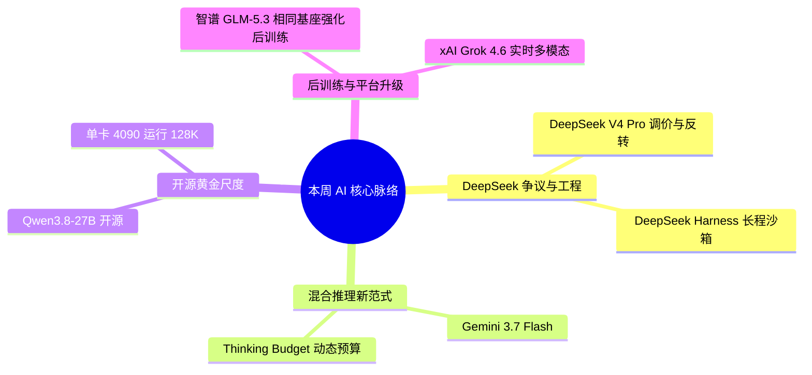

> **导语**：本周全球 AI 领域迎来密集爆发与激烈探讨。国内方面，**DeepSeek V4 Pro 正式版** 上线引发关于“**大幅调价、实测落差与跑分多次反转**”的行业大争论，同步开源 **DeepSeek Harness** 补齐长程智能体沙箱基建；阿里通义千问正式开源 **Qwen3.8-27B 黄金尺寸权重**（单卡 4090 可跑 128K）；智谱 AI 发布 **GLM-5.3**，在与 GLM-5.2 相同的基座模型上通过后训练扩展强化编程能力，并在官方自建 **Z.ai Code Bench** 体验评测中较 GLM-5.2 提升 50%；国际方面，Google DeepMind 推出首款混合推理模型 **Gemini 3.7 Flash**，马斯克旗下 xAI 发布 **Grok 4.6**。

---

## 🗺️ 本周主线脉络

---

## 🌟 核心深度剖析（6 大重磅事件）

### 01. [DeepSeek V4 Pro 发布：性能多次反转、大幅调价与社区争议](https://github.com/deepseek-ai)
- **发布主体**：DeepSeek · 2026-08-14
- **核心事实**：
  - DeepSeek 正式上线 V4 Pro 正式版模型。发布初官方在 MATH-500、AIME 2026 和 LiveCodeBench 等基准测试中公布压倒性领先数据；
  - 但随后在真实复杂业务与工程仓库实测中引发极大落差与质疑，出现幻觉增加、格式遵循漂移及长程推理死循环等问题；
  - 随后社区各团队通过针对性 Prompt 优化、搭配 Harness 沙箱与控制思考链长度，在长程任务成功率上再度反转回升；
  - 伴随发布的是 **API 定价大幅上调**（输入/思考输出 Token 价格显著提升），打破了以往“无脑低价”的市场认知，引发关于商业化转向的激烈讨论。
- **行业影响**：终结了“盲目无脑低价平替”时代，倒逼开发者从单纯追求便宜转向精准核算复杂任务 ROI，并必须依赖 Harness 等工程约束来锁住模型真实性能上限。
- **实操与避坑建议**：
  - 切勿盲目直接替换旧版线上流水线；
  - 结合涨价后的成本，严格核算单任务真实 ROI；
  - 必须在私有代码库中跑定制化回归测试集，配合 Harness 状态管理避免长程推理漂移。

---

### 02. [DeepSeek Harness 发布：长程智能体自主研发与沙箱评测标准](https://github.com/deepseek-ai/deepseek-harness)
- **发布主体**：DeepSeek GitHub · 2026-08-15
- **核心事实**：DeepSeek 正式开源 DeepSeek Harness，专为长生命周期自主智能体（Long-Running Agent）打造的一体化工程框架与隔离沙箱环境。内置状态快照持久化、多轮工具调用自动纠错循环、断点恢复与标准化评测基准，解决长任务执行失控与评测环境污染问题。
- **行业影响**：行业从“单次提示词工程”正式跨入“系统化构建运行 Harness、断点恢复与回归测试套件”的工程化新阶段。
- **实操与避坑建议**：
  - 正在开发 Coding Agent 或企业自动化流水线的团队，可直接克隆 Harness 搭建测试基准。
  - 建议利用其标准化沙箱复现从任务派发、环境隔离到结果验证的完整工程闭环。

---

### 03. [Gemini 3.7 Flash：首款混合推理模型，极速与深思合二为一](https://deepmind.google/technologies/gemini/flash/)
- **发布主体**：Google DeepMind · 2026-08-12
- **核心事实**：Google DeepMind 正式推出 Gemini 3.7 Flash，首创混合推理（Hybrid Reasoning）架构。单一模型可在极速直接响应（Flash 延迟）与多步深度思考模式（Thinking 深度）之间自由平滑切换。开发者可根据场景精确控制“思考 Token 预算”（Thinking Budget），在保持 Flash 级别低延迟与定价的同时，大幅提升代码与高难度逻辑推理表现。
- **行业影响**：终结了“快模型”与“慢思考模型”割裂部署的时代，通过统一的动态 Budget 机制兼顾了实时交互与高阶决策。
- **实操与避坑建议**：
  - Google AI Studio 与 Vertex AI 均已上线。
  - 在复杂架构设计与代码重构场景中调高 Thinking Budget，在日常即时问答场景中设为 0，兼顾响应速度与 API 成本。

---

### 04. [Qwen3.8-27B 权重开源：单卡可跑的高性能黄金尺寸](https://huggingface.co/Qwen/Qwen3.8-27B-Instruct)
- **发布主体**：阿里通义千问 · 2026-08-11
- **核心事实**：阿里通义千问团队正式开源 Qwen3.8-27B 基础权重与 Instruct 指令微调版，遵循宽松开源协议。官方提供 BF16、FP8、GPTQ 与 AWQ 等多精度量化版本，单张 RTX 4090 或双卡消费级显卡即可流畅运行 128K 上下文推理与本地工具调用。
- **行业影响**：填补了 70B 显存门槛过高与 7B/14B 复杂任务推理不足之间的关键空白，成为本地个人 Agent 与企业私有化部署的首选“甜点级”底座。
- **实操与避坑建议**：
  - Ollama、vLLM 与 SGLang 均已 Day-0 支持。
  - 个人开发者可直接下载 4-bit 量化版跑本地代码助理或文档知识库，企业可直接用于私有化 Agent 业务落地。

---

### 05. [智谱发布 GLM-5.3：相同基座下扩展后训练，强化编程与安全能力](https://www.zhipuai.cn/zh/research/162)
- **发布主体**：智谱 AI · 2026-08-14
- **核心事实**：
  - 智谱 AI 正式发布 GLM-5.3；
  - 官方称 GLM-5.3 与 GLM-5.2 使用相同的基座模型，能力增益主要来自后训练阶段的规模化扩展；
  - 官方自建的 **Z.ai Code Bench** 体验评测显示，GLM-5.3 较 GLM-5.2 提升 50%。这一数字仅适用于该内部评测，不能外推为所有任务的通用性能增幅；
  - 官方同时披露了模型在网络安全任务中的能力，并介绍了分层风险审查与使用边界。
- **行业影响**：GLM-5.3 展示了后训练扩展在编程与智能体任务上的工程潜力，但具体收益仍需等待公开权重、第三方基准和真实业务回归测试验证。
- **实操与避坑建议**：
  - 发布时官方表述为 API 即将上线、模型权重计划随后开放，应以官方后续公告为准；
  - 接入前重点测试企业内部高合规场景与多工具调用，不要把单一内部评测的 50% 提升直接套用到生产业务。

---

### 06. [xAI 发布 Grok 4.6：超大多模态推理与实时全网认知换代](https://x.ai/blog/grok-4-6)
- **发布主体**：xAI / Elon Musk · 2026-08-12
- **核心事实**：马斯克旗下 xAI 正式发布 Grok 4.6，在万亿级参数混合专家架构上进一步优化训练算法与实时信息检索流。新版本大幅强化了实时图表/多模态视频物理因果分析、全网实时热点脉络梳理及长程编程调试能力，X 平台 Premium+ 用户与 API 同步开放。
- **行业影响**：强化了 xAI 依托实时社交网络数据与大规模算力集群形成的即时感知壁垒，在多模态实时分析场景形成差异化竞争。
- **实操与避坑建议**：
  - 有 X 平台订阅的用户可直接在 Grok 面板体验实时深度搜索与视频分析；API 开发者可在 xAI 控制台申请接入 `grok-4.6` 接口。

---

## ⚡ 全景快讯扫读（18 条快板）

### 🛡️ 模型与安全
1. **[GPT-5.6-Cyber](https://openai.com/index/expanding-daybreak-as-the-cyber-defense-window-narrows)**：OpenAI 推出专用防御模型，面向授权研究员强化漏洞复现与防御。 *(OpenAI · 08/10)*
2. **[Ling-3.0-tiny](https://huggingface.co/inclusionAI/Ling-3.0-tiny)**：蚂蚁开源 1.3B 激活参数超轻量端侧 MoE 模型，主打极低显存端侧部署。 *(蚂蚁百灵 · 08/11)*
3. **[VoiceChat 11B](https://www.marktechpost.com/2026/08/09/nvidia-releases-nemotronlabs-voicechat-11b-an-open-full-duplex-speech-to-speech-model-with-450-ms-turn-taking-and-live-tool-calling)**：NVIDIA 开源全双工语音模型，支持 450ms 极速轮换与实时工具调用。 *(NVIDIA · 08/09)*
4. **[黎曼猜想研究](https://www.anthropic.com/research/riemann-zeta)**：Anthropic 披露未发布研究版模型将 Riemann zeta 零点下界从 41.6% 提升至 67.2%。 *(Anthropic · 08/09)*

### 📱 产品入口与开发者工具
5. **[ZCode 全面升级](https://mp.weixin.qq.com/s?__biz=MzkyMzI3NzQ0Mg%3D%3D&mid=2247494052&idx=1&sn=ee3ab3d0f4550e9120927c53a27522c9)**：智谱上线 Goal 目标拆解、Subagents 子智能体、Remote Control 与闲时任务。 *(智谱 · 08/11)*
6. **[桌面端语音操控](https://www.ithome.com/0/987/452.htm)**：ChatGPT 桌面端开始支持系统级语音操作，可语音操控电脑执行多步骤复杂任务。 *(IT之家 · 08/08)*
7. **[Auto 路由器 v2](https://openrouter.ai/blog/announcements/introducing-the-new-auto-router)**：OpenRouter 升级基于全网实时市场表现的智能动态加权路由器。 *(OpenRouter · 08/10)*
8. **[千问开放平台](https://mp.weixin.qq.com/s?__biz=MzYzNDE5MDEwMQ%3D%3D&mid=2247488345&idx=1&sn=ef4e57c9c9350f9238d90211eb2dd453)**：阿里千问上线开放平台，租房、理财等第三方生活与办公服务接入对话直接办理。 *(阿里千问 · 08/10)*

### 🛠️ 开源与基础设施
9. **[SGLang × Muse](https://www.lmsys.org/blog/2026-08-10-meta-muse-glimmer)**：高性能推理引擎 SGLang 为 Meta Muse 系列模型提供 Day-0 本地加速支持。 *(LMSYS · 08/10)*
10. **[OpenChamber](https://openchamber.dev/)**：开源面向自主智能体协同的原生交互开发环境与执行空间。 *(OpenChamber · 08/10)*
11. **[ComfyUI × H3](https://www.marktechpost.com/2026/08/10/implementing-a-minimax-h3-multimodal-video-and-audio-generation-pipeline-with-comfyui-apis)**：社区与官方集成 MiniMax-H3 2K 原生双声道音视频生成流水线。 *(MarkTechPost · 08/11)*
12. **[Genie 混合治理](https://www.databricks.com/blog/how-ground-genie-agents-both-structured-data-and-documents-without-losing-governance)**：Databricks 推出 Genie Agents 架构，兼顾结构化数据与文档治理。 *(Databricks · 08/10)*

### 💡 工程博客与技术访谈
13. **[Agent 语言与 Token 损耗](http://danluu.com/pl-tokens)**：知名工程师 Dan Luu 深入分析编写智能体宿主时的编程语言选型对上下文 Token 损耗的影响。 *(Dan Luu · 08/11)*
14. **[Computer Use 实测报告](https://github.com/anthropics/anthropic-quickstarts/tree/main/computer-use-demo)**：A16Z 实测主流智能体在真实桌面系统中的操作成功率与长尾卡点。 *(a16z · 08/10)*
15. **[Claude Code Auto 解析](https://x.com/ClaudeDevs/status/2086844755770757531)**：Anthropic 详解自动模式执行原理与多 Agent 上下文管理。 *(Claude Devs · 08/10)*

### 🔬 学术论文与前沿研究
16. **[推理轨迹重用漏洞](https://arxiv.org/abs/2608.09867)**：论文揭示专有大模型 API 加密块跨会话互换可能引发解密越狱。 *(arXiv · 08/10)*
17. **[RynnValue 具身智能](https://arxiv.org/abs/2608.09853)**：基于时空距离扩展的大规模机器人价值基础模型。 *(arXiv · 08/10)*
18. **[基准指纹识别](https://arxiv.org/abs/2608.08722)**：系统评估 LLM 驱动搜索在选拔压力下的基准指纹与数据污染风险。 *(arXiv · 08/09)*

### 💼 行业、投融资与人事
- **[5000 亿 AI 工厂联盟](https://x.com/JensenHuang/status/2086934705207959965)**：黄仁勋宣布英伟达联合六大国际财团组建 5000 亿美元算力基建联盟。 *(NVIDIA · 08/10)*
- **[宇树科技上市申购](https://www.ithome.com/0/987/649.htm)**：宇树科技启动 A 股申购，人形机器人第一股正式落地。 *(IT之家 · 08/09)*
- **[Anthropic 筹备上市](https://www.ithome.com/0/988/239.htm)**：消息称 Anthropic 启动上市准备并向投资者披露财务治理模型。 *(IT之家 · 08/11)*

---

## 🎯 下周继续盯什么

1. **DeepSeek V4 Pro 真实 ROI 与 Harness 实测**：大幅调价后在真实生产工程中的性能留存与沙箱恢复表现。
2. **Gemini 3.7 Flash 思考预算收益**：评测不同 Thinking Budget 在代码与复杂规划任务中的性价比拐点。
3. **智谱 GLM-5.3 企业落地**：关注其 API 与权重开放进度，并验证官方自建 Z.ai Code Bench 中 50% 提升在真实业务中的可迁移性。
