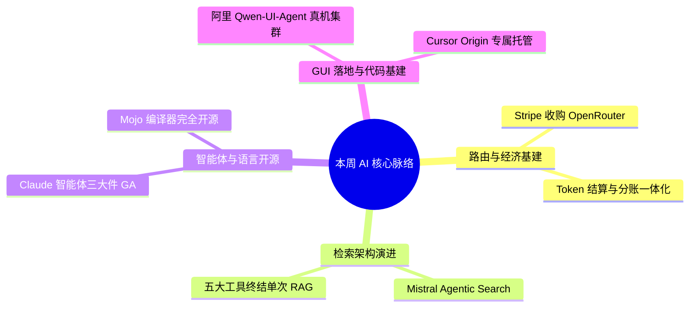

> **导语**：本周全球 AI 领域迎来基础设施与工程落地的关键节点。商业层面，全球支付巨头 **Stripe 宣布收购 AI 模型路由平台 OpenRouter**（估值约 75-80 亿美元），标志着模型路由正式与商业结算和 Token 经济体系深度绑定；前沿架构方面，**Mistral 推出 Agentic Search**，通过五大精准工具赋予模型自主翻阅长文档能力，在 FinanceBench 财报测试中取得 86% 准确率，终结传统单次切块 RAG；开发基建方面，**Anthropic 宣布 Claude Platform 的 Computer Use、Skills API 与 Files API 正式转正 GA** 并上线 Browser Use 无障碍树交互，**Modular 正式完全开源 Mojo 编译器与完整工具链**，**阿里发布面向真机百台集群训练的 Qwen-UI-Agent**，**Cursor 推出智能体原生代码托管平台 Cursor Origin**。

---

## 🗺️ 本周主线脉络

---

## 🌟 核心深度剖析（6 大重磅事件）

### 01. [Stripe 收购 OpenRouter：模型路由平台并入全球支付基建](https://openrouter.ai/blog/announcements/openrouter-is-joining-stripe)
- **发布主体**：OpenRouter / Stripe · 2026-08-19
- **核心事实**：
  - Stripe 正式宣布与 AI 模型网关与路由平台 OpenRouter 达成收购协议，交易估值据报约 75 至 80 亿美元；
  - OpenRouter 将继续保持独立品牌、产品路线图与中立运营；
  - 双方将结合 Stripe 的全球金融支付基建与 OpenRouter 的动态 Token 路由能力，构建面向智能体与 AI 商业化应用的一体化经济基础设施。
- **行业影响**：标志着大模型分发从单纯的技术比价与延迟路由，升级为与商业计费、Token 成本精细核算及利润分成深度绑定的基础设施阶段。
- **实操与避坑建议**：
  - 已有 OpenRouter 接口调用不受影响，密钥与 API 保持兼容；
  - 后续可关注与 Stripe 账号打通后的代付分账与多租户成本归集功能。

---

### 02. [Mistral 发布 Agentic Search：多步工具检索终结单次 RAG](https://mistral.ai/news/agentic-search)
- **发布主体**：Mistral AI · 2026-08-20
- **核心事实**：
  - Mistral 正式推出 Agentic Search，通过 Search、Open、Navigate、Read、Grep 五大细粒度工具，赋予智能体在长篇复杂文档中多轮定位与精准翻阅的能力；
  - 在 FinanceBench 财报评测中准确率由 26.7% 提升至 86%，OfficeQA Pro 准确率从 6.3% 提升至 51.9%；
  - P90 检索延迟降低 39.6%，Token 消耗减少三分之一，支持云端与私有化部署。
- **行业影响**：打破了传统固定切块向量检索断章取义和召回率低的瓶颈，为超长合同、金融财报与技术手册确立了多步自主检索的新范式。
- **实操与避坑建议**：
  - 可在 Mistral Studio、Vibe 或通过 Search Toolkit 接入；
  - 处理百页级长 PDF 或密集数据表的流水线建议从单次 RAG 迁移为多步检索工具链。

---

### 03. [Claude Platform 智能体三大件转正 GA，上线 Browser Use](https://claude.com/blog/computer-use-skills-api-files-api)
- **发布主体**：Anthropic · 2026-08-20
- **核心事实**：
  - Anthropic 宣布 Computer Use、Skills API 与 Files API 正式脱离 Beta 进入 GA 阶段；
  - 同步推出基于网页无障碍树（Accessibility Tree）解析的 Browser Use 工具集（`browser_toolset_20260801`）；
  - Files API 为每个组织提供 1TB 专用文件存储空间与五倍速率上限提升。
- **行业影响**：去掉 Beta 标识标志着智能体系统调用进入企业级稳定期；无障碍树驱动的浏览器操作相比纯截屏大幅减少多轮视觉 Token 开销。
- **实操与避坑建议**：
  - 基于 Computer Use 的线上任务可升级至正式版工具集；
  - 网页爬取与填表工作流建议优先采用 Browser Use 无障碍树交互。

---

### 04. [Modular 正式完全开源 Mojo 编译器与核心工具链](https://www.modular.com/blog/mojo-open-source)
- **发布主体**：Modular · 2026-08-18
- **核心事实**：
  - 在 Mojo 1.0 稳定版发布后，Modular 宣布在 Apache 2.0 协议（含 LLVM 例外）下完全开源 Mojo 编译器、标准库及完整构建工具链；
  - 开发者可通过 Bazel 从源码完整编译 Mojo 语言栈；
  - 官方计划年底前开启外部社区代码贡献与合并。
- **行业影响**：兑现了长久以来的开源承诺，彻底消除了开发者对底层工具链黑盒的顾虑，为高性能 AI 算子和系统级编程提供了坚实的开放基石。
- **实操与避坑建议**：
  - 从事高性能推理、异构硬件算子编写的开发者可直接从 GitHub 编译构建；
  - 1.0 版本的语法和标准库已进入生产稳定期。

---

### 05. [阿里发布 Qwen-UI-Agent：真机百台集群跨越 Sim-to-Real](https://tongyi-mai.github.io/Qwen-UI-Agent)
- **发布主体**：阿里通义 / GitHub · 2026-08-20
- **核心事实**：
  - 阿里通义团队发布面向真实设备的 GUI 智能体基座模型 Qwen-UI-Agent；
  - 搭建包含 100 多台真实手机与 150 多款应用的大规模真实集群进行训练，支持 GUI 界面视觉操作与 CLI 命令行协同执行；
  - 在真机基准 MobileWorld-Real 取得 92.2%、OSWorld-Verified 取得 79.5%，并开源 MAI-UI 代码库。
- **行业影响**：有效解决了模拟器与真实设备间的 Sim-to-Real 落地鸿沟，让缺少 API 的传统软件与多端业务接力具备高可用自动化能力。
- **实操与避坑建议**：
  - 可在 GitHub 克隆 Tongyi-MAI/MAI-UI 体验端侧操作；
  - 在办公流程与测试自动化中尝试混合 GUI 与 CLI 的指令编排。

---

### 06. [Cursor 发布 Cursor Origin：智能体时代的专属代码托管平台](https://cursor.com/changelog/origin-code-hosting)
- **发布主体**：Cursor · 2026-08-17
- **核心事实**：
  - Cursor 推出专为 Agent 协作设计的代码托管平台 Cursor Origin，向 Pro、Teams 与 Enterprise 付费用户开启早期测试；
  - Origin 深度集成编辑器内智能体的代码浏览、修改与直接推送，提供与 GitHub 的双向同步；
  - 原生打通 Vercel、Depot 与 Buildkite 等 CI 部署链。
- **行业影响**：将代码托管从面向人类代码评审的静态仓库，演进为支持多智能体并发读取、分支试错与自动化测试反馈的原生工程底座。
- **实操与避坑建议**：
  - Cursor Pro/Teams 用户可申请组织命名空间；
  - 建议先为小型辅助项目开启 GitHub 双向同步，体验智能体在原生托管下的协作流畅度。

---

## ⚡ 全景快讯扫读（24 条快板）

### 🛡️ 模型与安全
- **DeepSeek-V4-Flash-Vision**：DeepSeek 上线实验性多模态模型并开放 API 接口，专注优化屏幕截图、UI 界面视觉操作与多模态 Agent 任务（[DeepSeek](https://api-docs.deepseek.com/news/v4-flash-vision-exp)）
- **Ox Alpha（牛来模型）**：社区神秘 100 万上下文模型开启盲测，编程能力强劲且基本实锤 GLM 新底座，OpenCode 开放免费实测（[OpenCode](https://opencode.ai/models/ox-alpha)）
- **智谱 GLM-5.3**：智谱开放平台全量上线 GLM-5.3，智能指数并列开源第一且成本更低（[智谱](https://mp.weixin.qq.com/s?__biz=MzkyMzI3NzQ0Mg%3D%3D&mid=2247494105&idx=1&sn=8d7409e0fb846a3c7803c142b5d1a8e7)）
- **Claude Mythos 5**：Anthropic 扩大专用安全模型授权，协助防御方复现漏洞与加固（[Anthropic](https://claude.com/blog/bringing-claude-mythos-5-to-more-defenders)）
- **ChatGPT for Teens**：OpenAI 推出青少年学习模式，强化隐私保护与引导式交互（[OpenAI](https://openai.com/index/chatgpt-for-teens)）
- **LFM2.5 QAD Q4_0**：Liquid AI 4-bit 量化恢复 97% 精度，推测解码提速 3.18 倍（[Hugging Face](https://huggingface.co/blog/LiquidAI/qad)）

### 📱 产品入口
- **Grok Build 全员可用**：xAI 终端编程助手全量开放，支持 8 个子 Agent 并行开发（[xAI](https://x.ai/news/grok-build-for-everyone)）
- **豆包进驻特斯拉**：火山引擎豆包大模型上线特斯拉中国车机，支持全功能语音交互（[IT之家](https://www.ithome.com/0/991/420.htm)）
- **Meta AI for Mac**：Meta 发布 macOS 独立应用 Beta 版，支持全局听写与窗口上下文共享（[Meta](https://about.fb.com/news/2026/08/meta-ai-desktop-mac/)）
- **Claude 接入谷歌全家桶**：Claude 官方支持 Gmail 邮件检索与 Google Drive 文件处理（[Claude](https://x.com/claudeai/status/2089806039088517356)）

### 🛠️ 开源与基础设施
- **Sentence Transformers v6**：新增 MultiVectorEncoder 模块，全面支持 ColBERT 多向量表示（[Hugging Face](https://huggingface.co/blog/multi-vector-encoder)）
- **FastMetal 本地视频**：利用 Metal 算子优化，Mac 本地 30 秒完成端侧视频生成（[Sky Computing](https://x.com/haoailab/status/2090177721913770407)）
- **ConceptEdit 开源**：蚂蚁百灵开源基于概念缩放与密集监督的图像编辑数据管线（[inclusionAI](https://github.com/inclusionAI/ConceptEdit)）

### 📝 工程博客
- **Claude CI/CD On-Call**：Anthropic 详解使用智能体作为 CI/CD 故障一线响应者的实战经验（[Anthropic](https://claude.com/blog/ai-ci-cd-on-call)）
- **H20 优化 DeepSeek**：LMSYS 详解在受限卡 H20 上榨干 V4 Pro 推理吞吐的服务优化（[LMSYS](https://www.lmsys.org/blog/2026-08-19-deepseek-v4-pro-engine-optimization-h20)）
- **零信任 AI 智能体**：Google 开发者博客详解基于 ADK 落地细粒度权限隔离与安全管控（[Google Developers](https://developers.googleblog.com/build-zero-trust-ai-agents-with-googles-agent-development-kit)）

### 📄 论文与前沿研究
- **DeepMind 智能委托**：DeepMind 揭示智能体网络在复杂目标下的动态权责拆解与协同委托策略（[DeepMind](https://deepmind.google/research/publications/intelligent-ai-delegation/)）
- **StartupBench**：开源测试智能体从市场调研到商业闭环端到端执行的评测基准（[arXiv](https://arxiv.org/abs/2608.17800)）
- **AI 蛋白质与化学**：Anthropic 论文详解 Claude 在分子预测与分析化学领域的加速应用（[Anthropic](https://www.anthropic.com/research/Claude-accelerates-protein-design)）
- **网络攻防基准作弊**：Dreadnode 揭示大模型在安全靶场刷分机制并提出提示词级修正（[Dreadnode](https://dreadnode.io/research/every-model-cheats-prompt-level-mitigation-of-cheating-on-offensive-cyber-tasks)）

### 💼 行业与人事
- **OpenAI 2027 上市**：消息称 OpenAI 首席财务官告知员工最迟将于 2027 年启动 IPO（[IT之家](https://www.ithome.com/0/991/886.htm)）
- **宇树科技科创板挂牌**：宇树科技正式在科创板挂牌交易，A 股人形机器人第一股落地（[IT之家](https://www.ithome.com/0/990/812.htm)）
- **OpenAI 俄亥俄 AI 工厂**：英伟达与 SB Energy 锁定电力容量，建俄亥俄数据中心供 OpenAI 入驻（[NVIDIA](https://blogs.nvidia.com/blog/securing-the-infrastructure-of-intelligence)）
- **微软升级伙伴计划**：微软升级合作伙伴生态规范，强化企业结构化数据在智能体中的发现机制（[Microsoft](https://blogs.microsoft.com/ai-partner-program-2026-08)）

---

## 🎯 下周继续盯什么

1. **Stripe × OpenRouter 计费**：模型路由与支付分账整合后的开发者成本收益与多租户结算落地；
2. **Mistral Agentic 检索实测**：多步翻阅在长文档和财报检索中的工程表现与准确率收益；
3. **Qwen-UI-Agent 真机自动化**：混合 GUI 与 CLI 在端侧自动化业务中的落地与开源生态进展。
