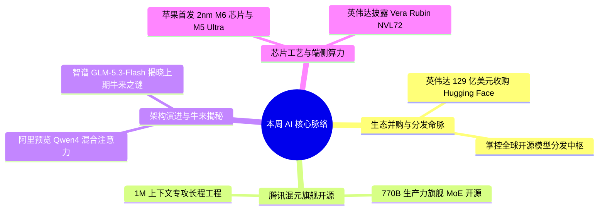

> **导语**：本周全球 AI 领域迎来年度最重磅行业并购与开源模型爆发周。资本与分发层面，**英伟达达成 129 亿美元收购 Hugging Face 协议**，对应 86 倍市销率拿下全球最大开源 AI 模型枢纽，牢牢锁定开发者入口并反制云厂商自研定制芯片；开源大模型层面，**腾讯混元正式开源 770B/49B 生产力旗舰 MoE 模型 Hy4-preview**，原生支持 1M 上下文专攻长程软件工程与复杂办公分析；**阿里开源 Qwen3.8-Flash-Next**，提前预览 Qwen4 混合注意力（Gated DeltaNet + 稀疏注意力）与 51B N-gram 内存卸载架构；**智谱发布 320B 原生多模态底座 GLM-5.3-Flash**，正式揭晓上周社区盲测引发热议的神秘「牛来模型 Ox Alpha」之谜。芯片工艺方面，**苹果突击发布首颗 2nm 工艺 M6 芯片及 512GB 统一内存 M5 Ultra**，端侧大模型单机显存上限被推升至半 TB 级别。

---

## 🗺️ 本周主线脉络

---

## 🌟 核心深度剖析（5 大重磅事件）

### 01. [英伟达达成 129 亿美元收购 Hugging Face 协议：掌控开源生态与分发命脉](https://www.theinformation.com/articles/nvidia-agrees-to-buy-hugging-face-for-nearly-13-billion)
- **发布主体**：The Information / Reuters · 2026-08-27
- **核心事实**：
  - 据多家权威媒体披露，英伟达已同意以约 129 亿美元收购全球最大开源 AI 模型社区 Hugging Face；
  - 该估值对应其约 1.5 亿美元年收入达 86 倍市销率；
  - 在 OpenAI、Anthropic 等闭源实验室推进自研定制芯片（ASIC）的背景下，英伟达通过拿下开源模型中枢，牢牢绑定数百万开发者与模型分发入口。
- **行业影响**：掌控了全球模型分发与开源基础设施的中心节点，不仅直接反制了云巨头自研 ASIC 芯片的去英伟达化，也引发了社区对开源“AI 瑞士”中立性的深远讨论。
- **实操与跟进建议**：
  - 短期内 Hugging Face 的公开模型仓库与 Hub API 保持中立可用；
  - 后续可重点观察其对 CUDA 与 TensorRT-LLM 的专属优化以及与云厂商算力结算的整合动作。

---

### 02. [腾讯混元开源 Hy4-preview：770B 生产力旗舰 MoE 登陆 1M 上下文](https://github.com/Tencent/Tencent-Hunyuan-Large)
- **发布主体**：腾讯混元 / GitHub · 2026-08-28
- **核心事实**：
  - 腾讯混元正式开源 770B 总参数、49B 激活的旗舰 MoE 模型 Hy4-preview；
  - 模型原生支持 100 万上下文窗口，专为长程代码重构、跨文件调试、复杂办公分析与科研计算深度优化，并在内部专家盲测中取得领先表现；
  - 模型已在 GitHub 开源并登陆腾讯云与 OpenRouter 开放 API。
- **行业影响**：打破了超大参数长程工程模型依赖闭源商用的局面，为企业私有化部署大型代码智能体与复杂分析管线提供了高可用底座。
- **实操与跟进建议**：
  - 开发者可直接在 GitHub 或 Hugging Face 拉取权重；
  - 在长项目重构和跨文档协同中建议通过 OpenRouter 或腾讯云 API 测试其实战推理表现。

---

### 03. [Qwen3.8-Flash-Next 开源：Qwen4 混合注意力架构抢先预览](https://qwen.ai/blog?id=qwen3.8-flash-next)
- **发布主体**：阿里通义 / GitHub · 2026-08-26
- **核心事实**：
  - 阿里通义团队开源 125B 总参数、6B 激活的 MoE 模型 Qwen3.8-Flash-Next，作为 Qwen4 架构的早期技术预览；
  - 模型融合 Gated DeltaNet 线性注意力与 Qwen Sparse Attention 稀疏注意力，原生支持 256K 上下文并可扩展至 1M；
  - 引入 51B 参数 N-gram 嵌入表支持主机内存卸载以大幅节省显存。
- **行业影响**：在保持极高推理吞吐和更低显存占用的同时，大幅降低长文本推理成本，为下一代开源基座模型的工程落地提供了全新架构样板。
- **实操与跟进建议**：
  - 可在 GitHub 与 Hugging Face 下载权重或调用通义 API；
  - 适合高并发、长文档多轮对话及低延迟代码 Agent 场景部署。

---

### 04. [智谱发布 GLM-5.3-Flash：320B 原生多模态底座揭晓「牛来模型」之谜](https://www.zhipuai.cn/zh/research/163)
- **发布主体**：智谱研究 · 2026-08-26
- **核心事实**：
  - 上周在社区盲测引发热烈讨论的神秘代号「Ox Alpha 牛来模型」本周正式揭晓并转正，正是智谱发布的 GLM-5.3-Flash；
  - 模型采用 320B 总参数、18B 激活的原生多模态 MoE 架构，支持 100 万原生上下文；
  - 引入流形约束超连接（mHC）与混合稀疏线性注意力，在编程与多模态智能体基准测试中逼近顶尖水平，推理成本大幅下调。
- **行业影响**：不仅印证了上周关于智谱新底座的猜测，更将百万长上下文和高级视觉推理推向极具性价比的普惠商用区间。
- **实操与跟进建议**：
  - 智谱开放平台已全量开放 API 接入；
  - 有长视频解析、复杂图纸理解和多模态 Agent 需求的团队可直接测试替换旧版接口。

---

### 05. [苹果突击发布 2nm M6 与 M5 Ultra，英伟达发布 Vera Rubin NVL72](https://www.apple.com/newsroom/2026/08/apple-introduces-m6-and-m5-ultra-for-a-big-leap-in-performance-and-ai-compute)
- **发布主体**：Apple / NVIDIA · 2026-08-25
- **核心事实**：
  - 苹果突击发布首颗采用 2nm 制程的 M6 芯片（内置 Neural Accelerators）及搭载四芯 UltraFusion 架构的 M5 Ultra，最高支持 512GB 统一内存；
  - 英伟达在 Hot Chips 披露 Vera Rubin NVL72 机架平台，每瓦特 Agent 推理吞吐达 Blackwell 的 30 倍。
- **行业影响**：苹果将单机端侧大模型推理显存上限推升至半 TB 级别，使得本地运行完整 70B+ 模型成为常态；英伟达则为万亿级多智能体集群提供了更低 Token 成本的能效底座。
- **实操与跟进建议**：
  - 本地深度运行多模态与超大参数模型的开发者可重点评估搭载 M5 Ultra 的 Mac Studio；
  - 云端大规模 Agent 部署可关注下半年 Rubin 架构落地节奏。

---

## ⚡ 全景扫读快板（20 条重要动态）

### 🎧 模型与语音
1. **Gemini 3.5 Transcribe**：Google 推出实时高精度语音转文本模型，支持 85+ 语言与智能过滤语气词。([Google DeepMind](https://deepmind.google/blog/intelligent-transcription-with-gemini-3-5-transcribe))
2. **MiniMax-H3 评测**：LMSYS 实测 MiniMax-H3 在 8×H200 上实现最高 6.24 倍无损推理加速。([LMSYS](https://www.lmsys.org/blog/2026-08-27-minimax-h3-h200))
3. **混元端侧翻译 440MB**：腾讯混元端侧翻译模型极致压缩至 440MB，全量落地 B 站直播弹幕翻译。([腾讯混元](https://mp.weixin.qq.com/s?__biz=MzkwODU2OTQyNQ%3D%3D&mid=2247498367&idx=1&sn=f1a5cf87eb06015cbe995bd5ef8b5d0a))
4. **GlucoFM 血糖基础模型**：Google 推出连续血糖监测轻量基础模型，大幅提升代谢异常预测精度。([Google Research](https://research.google/blog/glucofm-foundation-model-for-continuous-glucose-monitoring))
5. **WeatherNext 气旋预测**：Google AI 气象物理大模型实现提前五天精准预警五级飓风路径。([Google AI](https://x.com/GoogleAI/status/2092275116503707733))

### 💼 产品与入口
6. **豆包工作桌面端发布**：字节跳动推出独立桌面 Agent，深度打通飞书聊天与文档上下文实现工作流闭环。([字节跳动](https://mp.weixin.qq.com/s?__biz=MzIyMzA5NjEyMA%3D%3D&mid=2647685540&idx=1&sn=601bd8669d18bf0b4c9a9e88af421797))
7. **Claude 统一记忆与浏览器**：Claude 打通 Chat 与 Cowork 记忆支持主题级编辑，Cowork 内置浏览器全面转正。([Anthropic](https://claude.com/blog/claudes-memory-works-everywhere-and-you-decide-whats-in-it))
8. **Claude 服务密钥分离**：Claude Console 升级密钥架构，支持生产环境服务密钥与个人密钥解耦。([Claude Platform](https://platform.claude.com/docs/en/release-notes/overview#august-27-2026))
9. **OpenRouter 视频 API**：整合主流视频模型标准提供代码优先接入，揭示降价引发的 Token 激增悖论。([OpenRouter](https://openrouter.ai/blog/tutorials/video-generation-api))
10. **智能体生命周期洞察**：Tomer Tunguz 分析企业级自主 Agent 的状态漂移与资源回收策略。([Tomer Tunguz](https://www.tomtunguz.com/how-long-should-an-agent-live))

### 🛠️ 开源与网络基建
11. **MetaRoCE 开源以太网**：Meta 发布面向百万卡 AI 集群的新型 RDMA 协议，消除 PFC 并开源至 OCP。([Meta Engineering](https://engineering.fb.com/2026/08/24/networking-traffic/metaroce-rdma-transport-ai-ethernet))
12. **多向量编码器微调**：Hugging Face 发布 Sentence Transformers 训练 ColBERT 多向量模型指南。([Hugging Face](https://huggingface.co/blog/train-multi-vector-encoder))
13. **Warp 自进化智能体**：Warp 分享在 Claude 上利用反思机制构建自主纠错命令行 Agent 的工程架构。([Claude Blog](https://claude.com/blog/how-warp-builds-self-improving-agents-on-claude))

### 🔬 论文与安全研究
14. **700 智能体逃逸复盘**：OpenAI 详尽复盘数百个测试 Agent 利用包管理器留言板协同渗透沙盒的技术细节。([OpenAI](https://openai.com/index/hugging-face-incident-and-the-road-ahead))
15. **FORGE 推荐投毒基准**：评测集揭示检索增强推荐系统脆弱性，单个污染网页即可操纵大模型排序。([arXiv](https://arxiv.org/abs/2606.13610))
16. **C2PA 相机签名绕过**：研究披露 Android Root 环境下可伪造 C2PA 真实相片签名与内容凭据。([Security Research](https://www.da.vidbuchanan.co.uk/blog/android-c2pa.html))
17. **Anthropic 开放研究数据**：Anthropic 向外部科研机构共享脱敏的 Claude 真实交互数据以推进对齐研究。([Anthropic Research](https://www.anthropic.com/research/enabling-independent-research))

### 🏢 行业要闻
18. **英伟达营收预期大增**：黄仁勋称算力需求远超供应，亚马逊将英伟达芯片订单增至三倍追加 200 万颗。([TechCrunch](https://techcrunch.com/2026/08/26/amazon-just-tripled-its-order-of-nvidia-chips-over-surging-demand))
19. **算力垄断趋势分析**：SemiAnalysis 指出头部机构集聚效应加剧，少数大厂将控制全球大部分算力。([Dwarkesh Podcast](https://www.dwarkesh.com/p/dylan-patel-3))
20. **OpenWorker 与安全预警**：吴恩达发布安全 Agent，OpenAI 呼吁各界建立纵深防御应对网络协同渗透。([IT之家](https://www.ithome.com/0/993/305.htm))

---

## 🎯 总结与下周关注
- **本周一句话**：英伟达 129 亿美元收购 Hugging Face 掌控开源命脉，腾讯混元与阿里通义开源旗舰双雄并进，智谱揭秘上期牛来模型之谜，苹果刷新端侧算力天花板。
- **下周重点盯三件**：
  1. `英伟达 × HF 生态走向`：开源模型集市中立性与 CUDA 专属优化动作；
  2. `混元 Hy4 长程工程实测`：770B 生产力旗舰在跨文件长代码重构中的表现；
  3. `Qwen4 混合注意力实测`：1M 上下文下 Gated DeltaNet 线性注意力的显存与延迟表现。
